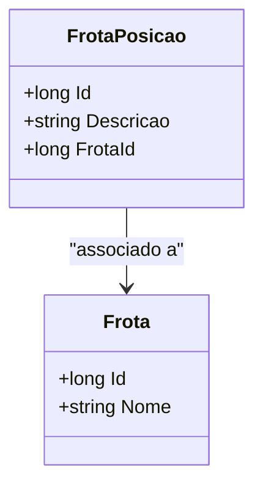

# FrotaPosicao
**Namespace**: IsthmusWinthor.Dominio.Entidades  
**Nome do Arquivo**: FrotaPosicao.cs  

## Visão Geral e Responsabilidade
A classe `FrotaPosicao` representa a posição de uma frota dentro do sistema, atuando como parte fundamental no gerenciamento de frotas de transporte. Sua principal responsabilidade é associar uma descrição a uma frota específica, permitindo a rastreabilidade e controle das posições em que as frotas se encontram, o que é crítico para a gestão eficiente de recursos e operações logísticas.

## Métodos de Negócio
- **Título**: Nenhum método com lógica de negócio implementado.

(Segundo o código fornecido, não há métodos além de getters e setters simples.)

## Propriedades Calculadas e de Validação
- **Id**: Representa a identificação única da posição da frota.
- **Descricao**: Aceita uma descrição que deve ser válida e significativa para o contexto da frota.
- **FrotaId**: Identifica a frota associada. Este valor deve corresponder a uma frota existente, garantindo integridade referencial no sistema.

## Navigations Property
- **Frota**: Propriedade que representa a associação com a frota correspondente.  
  [Frota](Frota.md)

## Tipos Auxiliares e Dependências
Nenhuma enumeração ou classe auxiliar é utilizada diretamente nesta classe.

## Diagrama de Relacionamentos

---
Gerada em 29/12/2025 20:35:18
