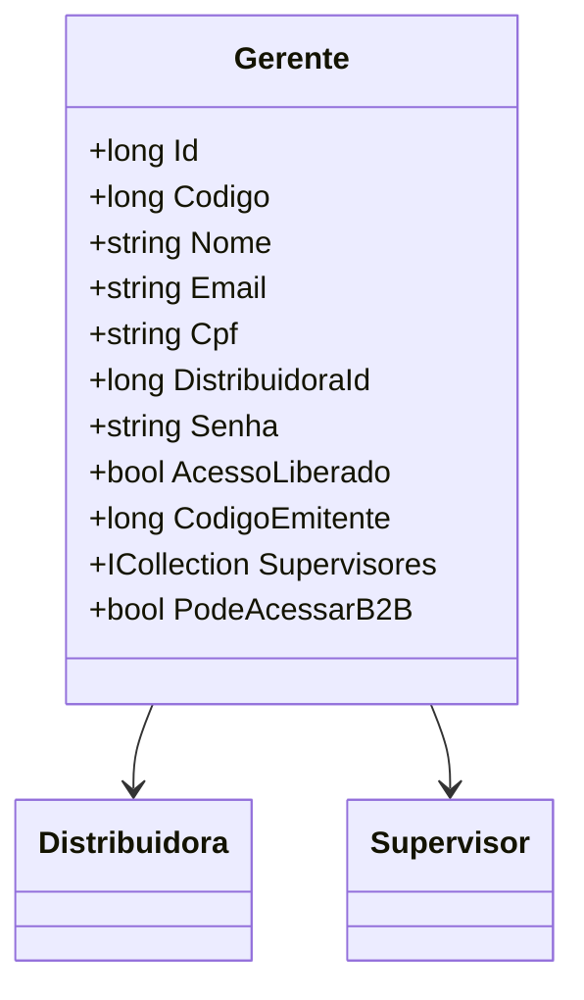

# Gerente

**Namespace**: IsthmusWinthor.Dominio.Entidades  
**Nome do Arquivo**: Gerente.cs  

## Visão Geral e Responsabilidade
A classe `Gerente` representa um gerente dentro do sistema, responsável por supervisionar uma ou mais distribuidoras e seus respectivos supervisores. O problema de negócio que esta classe resolve está relacionado ao controle de acesso e permissões dentro do sistema, assegurando que apenas gerentes com credenciais válidas e autorização possam acessar determinados recursos, como o sistema B2B.

## Métodos de Negócio

### Título: `PodeAcessarB2B` (Propriedade Calculada)

- **Objetivo**: Determina se o gerente possui permissão para acessar o sistema B2B.
- **Comportamento**: A propriedade avalia se a senha do gerente está definida e se o acesso está liberado (`AcessoLiberado`). Apenas se ambas as condições forem verdadeiras, o gerente tem permissão para acesso.
- **Retorno**: Retorna um valor booleano (`true` ou `false`). `true` significa que o gerente pode acessar o sistema B2B, enquanto `false` indica que o acesso é restrito.

## Propriedades Calculadas e de Validação

- **PodeAcessarB2B**: Verifica se o gerente pode acessar o sistema B2B com base na presença de senha e no status de acesso liberado.

## Navigation Property

- [Distribuidora](Distribuidora.md): Representa a distribuição associada ao gerente.
- [Supervisor](Supervisor.md): Coleção de supervisores que são gerenciados por este gerente.

## Tipos Auxiliares e Dependências

- Classes que a `Gerente` utiliza:
  - [IEntidade](IEntidade.md): Interface que representa uma entidade no domínio, a qual `Gerente` implementa.
  
## Diagrama de Relacionamentos

Este documento tem como objetivo delinear as regras de negócio e a estrutura da classe `Gerente`, auxiliando na compreensão e manutenção da lógica subjacente do sistema.
