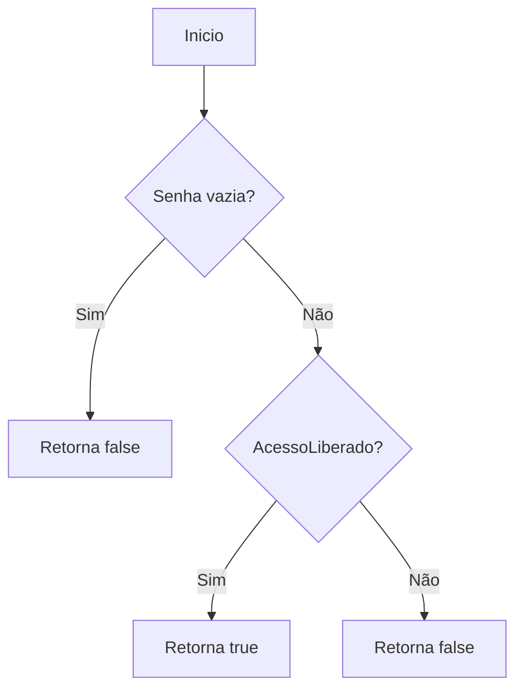
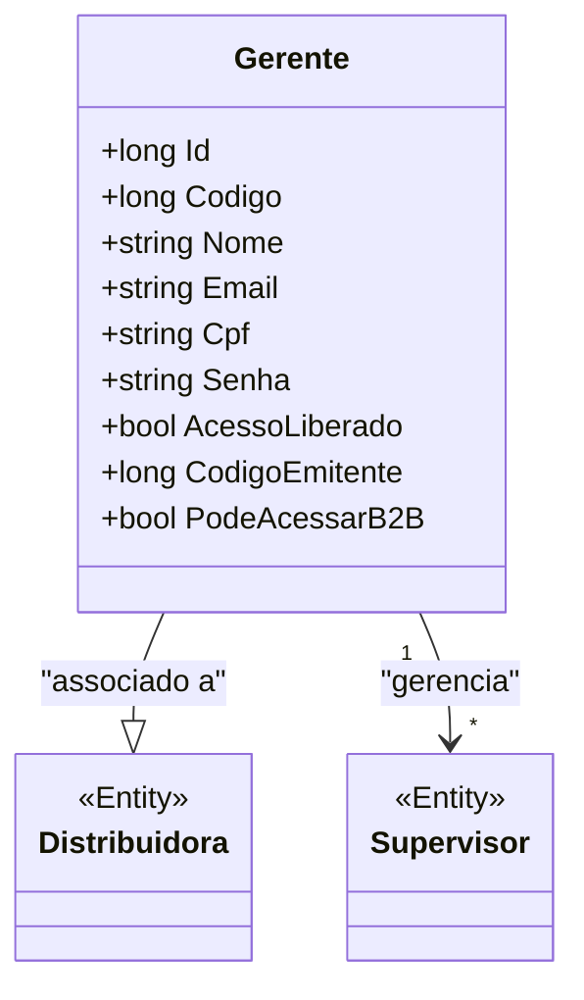

# Gerente

**Namespace**: IsthmusWinthor.Dominio.Entidades  
**Nome do Arquivo**: Gerente.cs

## Visão Geral e Responsabilidade
A classe `Gerente` representa a entidade responsável pela gestão de supervisores dentro de uma distribuidora. Ela encapsula as informações necessárias para que um gerente possa acessar funcionalidades específicas do sistema, como o acesso ao sistema B2B. A habilidade de garantir que um gerente tenha o acesso liberado é fundamental para a segurança e controle de operações dentro da organização.

## Métodos de Negócio
### Método: AcessoLiberado (Propriedade)
#### Objetivo:
Este método garante que o gerente tenha o acesso liberado para sistemas críticos, como o B2B.

#### Comportamento:
1. Verifica se a propriedade `Senha` não está vazia.
2. Avalia se a propriedade `AcessoLiberado` é verdadeira.
3. Se ambas as condições forem atendidas, retorna `true`; caso contrário, retorna `false`.

#### Retorno:
O valor retornado indica se o gerente possui ou não acesso ao sistema B2B: `true` se sim, `false` caso contrário.

## Propriedades Calculadas e de Validação
- **PodeAcessarB2B**: Esta propriedade determina se o gerente pode acessar o sistema B2B baseado na validade da `Senha` e na propriedade `AcessoLiberado`. A regra de negócio aqui é que um gerente só deve ter acesso se sua senha estiver definida e o acesso estiver liberado.

## Navigations Property
- [Distribuidora](Distribuidora.md): Representa a distribuidora à qual o gerente está associado.
- [Supervisor](Supervisor.md): Classe que representa os supervisores gerenciados pelo gerente; uma coleção é mantida dentro da propriedade `Supervisores`.

## Tipos Auxiliares e Dependências
- **Enums**: Nenhum enumerador utilizado na classe.
- **Classes Auxiliares**: Não há classes auxiliares ou helpers diretamente utilizadas na implementação.

## Diagrama de Relacionamentos

Essa documentação proporciona uma visão clara do funcionamento interno da classe `Gerente`, suas responsabilidades, propriedades e seus relacionamentos, assegurando a inteireza dos dados e a compreensão do fluxo de acesso às funcionalidades do sistema.
---
Gerada em 29/12/2025 20:35:34
