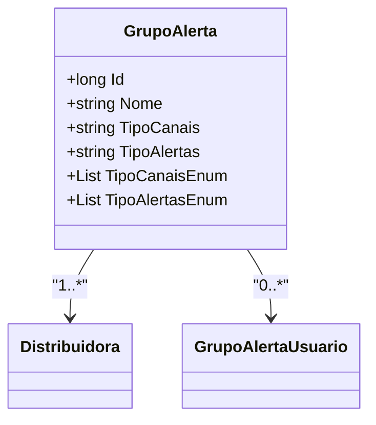

# GrupoAlerta
- **Namespace**: IsthmusWinthor.Dominio.Entidades
- **Nome do Arquivo**: GrupoAlerta.cs

## Visão Geral e Responsabilidade
A classe `GrupoAlerta` representa um grupo de alertas associado a uma distribuidora específica e gerencia a relação entre os canais e tipos de alertas do sistema. Ela é responsável por assegurar que alertas corretos sejam enviados aos usuários associados ao grupo, conforme suas configurações de canal e tipo de alerta desejados.

## Métodos de Negócio
### Título: `TipoCanaisEnum` (Visibilidade: pública)
- **Objetivo**: Este método garante que os tipos de canais associados ao `GrupoAlerta` sejam interpretados corretamente a partir de uma string delimitada por vírgulas; convertendo-os para um formato que o sistema pode manipular.
- **Comportamento**:
    1. Verifica se a propriedade `TipoCanais` está vazia ou nula.
    2. Se a propriedade estiver preenchida, tenta dividir a string em várias partes usando a vírgula como delimitador.
    3. Para cada parte resultante, tenta fazer o parse para o enum `TipoCanal`, adicionando o valor associado à lista `canaisEnum`.
    4. Se houver um erro durante o parsing, retorna uma lista vazia.
- **Retorno**: Retorna uma lista de `TipoCanal`, que representa os canais disponíveis para o grupo de alerta.

```mermaid
flowchart TD
    A[TipoCanais: string] -->|isEmpty?| B{true}
    B -->|Yes| C[Return empty list]
    B -->|No| D[Split by ","]
    D --> E[Parse to TipoCanal]
    E -->|Success| F[Add to canaisEnum]
    E -->|Error| C
    F --> G[Return canaisEnum]
```

### Título: `TipoAlertasEnum` (Visibilidade: pública)
- **Objetivo**: Similar ao método anterior, este garante que os tipos de alertas sejam corretamente convertidos para um formato utilizável a partir de uma string.
- **Comportamento**:
    1. Verifica se a propriedade `TipoAlertas` está vazia ou nula.
    2. Caso esteja preenchida, divide a string em várias partes usando a vírgula como delimitador.
    3. Cada parte é convertida para o enum `TipoAlerta`, e os valores são adicionados a uma lista `alertasEnum`.
    4. Em caso de erro durante o parsing, uma lista vazia é retornada.
- **Retorno**: Retorna uma lista de `TipoAlerta`, representando os tipos de alertas disponíveis para o grupo de alerta.

```mermaid
flowchart TD
    A[TipoAlertas: string] -->|isEmpty?| B{true}
    B -->|Yes| C[Return empty list]
    B -->|No| D[Split by ","]
    D --> E[Parse to TipoAlerta]
    E -->|Success| F[Add to alertasEnum]
    E -->|Error| C
    F --> G[Return alertasEnum]
```

## Propriedades Calculadas e de Validação
- `TipoCanaisEnum`: Converte a string contida em `TipoCanais` em uma lista de `TipoCanal`, interpretando adequadamente possíveis valores delimitados por vírgula e tratando exceções durante o processo.
- `TipoAlertasEnum`: Similarmente, converte a string em `TipoAlertas` para uma lista de `TipoAlerta`, permitindo melhor gerenciamento dos tipos de alertas.

## Navigations Property
- [`Distribuidora`](Distribuidora.md)
- [`GrupoAlertaUsuario`](GrupoAlertaUsuario.md)

## Tipos Auxiliares e Dependências
- [`TipoCanal`](TipoCanal.md)
- [`TipoAlerta`](TipoAlerta.md)

## Diagrama de Relacionamentos

