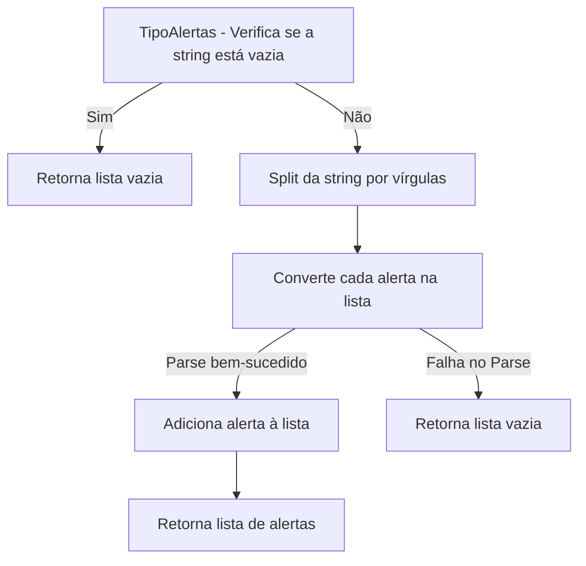
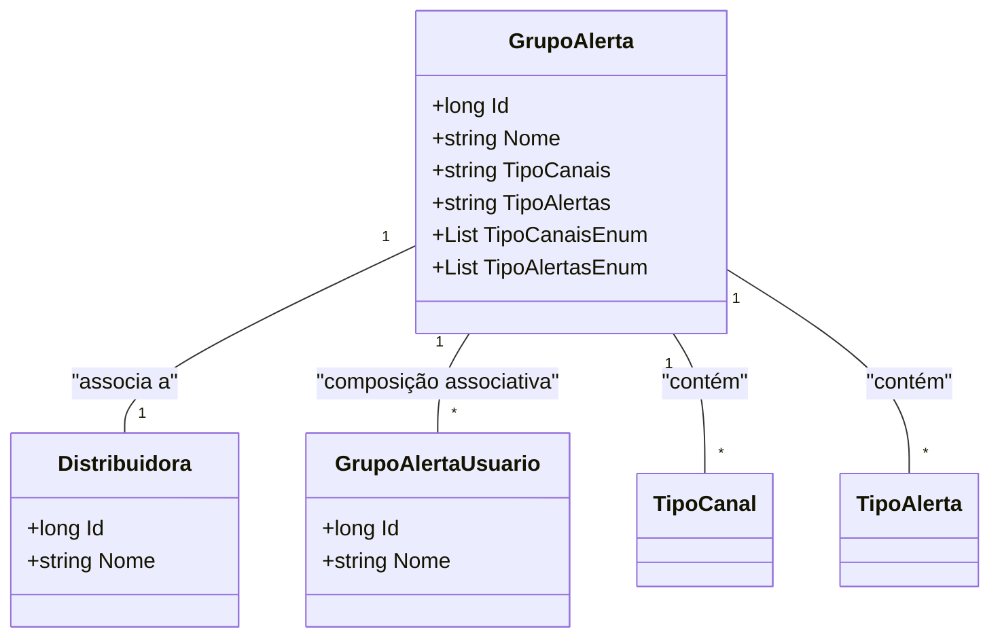

# GrupoAlerta
**Namespace**: IsthmusWinthor.Dominio.Entidades  
**Nome do Arquivo**: GrupoAlerta.cs  

## Visão Geral e Responsabilidade
A classe `GrupoAlerta` representa um modelo de domínio que detalha um grupo de alertas associados a uma distribuidora no sistema. O problema de negócio que essa classe resolve é a necessidade de organizar e gerenciar alertas que podem ser enviados através de diferentes canais para usuários associados. A classe permite a agregação de canais e tipos de alertas, facilitando a configuração e o gerenciamento do envio de notificações.

## Métodos de Negócio

### Método: TipoCanaisEnum (get)
- **Objetivo**: Garantir a conversão e a estruturação adequada dos tipos de canais em uma lista de enumeradores do tipo `TipoCanal`.
- **Comportamento**:
  1. Verifica se a propriedade `TipoCanais` é nula ou vazia. Se sim, retorna uma lista vazia.
  2. Tenta dividir a string `TipoCanais` por vírgulas. Se houver mais de um canal, itera sobre cada um.
  3. Para cada canal, realiza o parsing da string para o enumerador `TipoCanal`.
  4. Adiciona o valor convertido à lista `canaisEnum`.
  5. Retorna a lista de canais convertidos. Se ocorrer uma exceção durante o parsing, também retorna uma lista vazia.
- **Retorno**: Uma lista de entidades do tipo `TipoCanal` representando os canais válidos encontrados na string.

### Método: TipoAlertasEnum (get)
- **Objetivo**: Garantir a conversão e a estruturação adequada dos tipos de alertas em uma lista de enumeradores do tipo `TipoAlerta`.
- **Comportamento**:
  1. Verifica se a propriedade `TipoAlertas` é nula ou vazia. Se sim, retorna uma lista vazia.
  2. Tenta dividir a string `TipoAlertas` por vírgulas. Se houver mais de um alerta, itera sobre cada um.
  3. Para cada alerta, realiza o parsing da string para o enumerador `TipoAlerta`.
  4. Adiciona o valor convertido à lista `alertasEnum`.
  5. Retorna a lista de alertas convertidos. Se ocorrer uma exceção durante o parsing, também retorna uma lista vazia.
- **Retorno**: Uma lista de entidades do tipo `TipoAlerta` representando os alertas válidos encontrados na string.

## Propriedades Calculadas e de Validação

### Propriedades Calculadas
- **TipoCanaisEnum**: Converte a string `TipoCanais` em uma lista de valores do tipo `TipoCanal` com validações para garantir que a conversão seja segura e manuseia exceções.
- **TipoAlertasEnum**: Converte a string `TipoAlertas` em uma lista de valores do tipo `TipoAlerta`, também com validações e tratamento de exceções.

## Navigations Property
- **Distribuidora**: Representa a associação do grupo de alertas a uma distribuidora. [Distribuidora](Distribuidora.md)
- **GrupoAlertaUsuarios**: Representa uma coleção de usuários associados ao grupo de alerta. [GrupoAlertaUsuario](GrupoAlertaUsuario.md)

## Tipos Auxiliares e Dependências
- **Enumeradores**: 
  - [TipoCanal](TipoCanal.md)
  - [TipoAlerta](TipoAlerta.md)

## Diagrama de Relacionamentos

Esta documentação fornece uma visão técnica aprofundada da classe `GrupoAlerta`, suas responsabilidades, regras de negócio implementadas e como as propriedades e métodos interagem para atender às demandas do sistema.
---
Gerada em 29/12/2025 20:36:02
