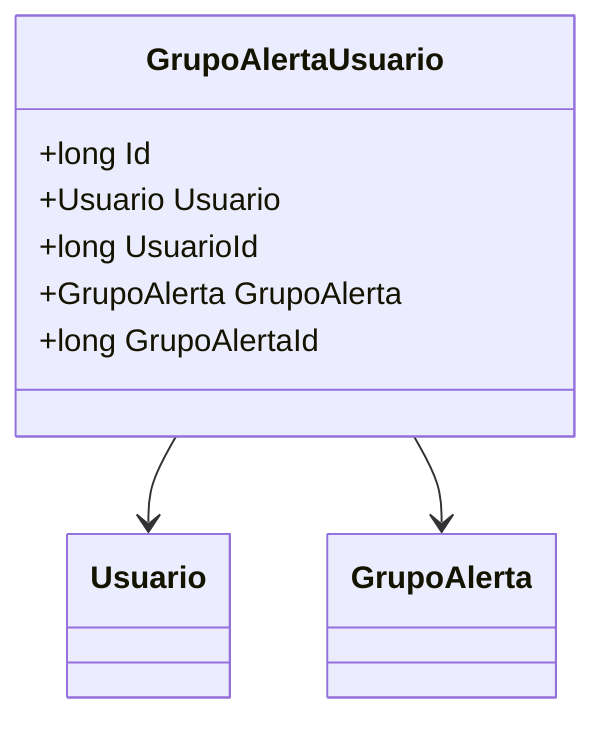

# GrupoAlertaUsuario
**Namespace**: IsthmusWinthor.Dominio.Entidades  
**Nome do Arquivo**: GrupoAlertaUsuario.cs  

## Visão Geral e Responsabilidade
A classe `GrupoAlertaUsuario` representa a relação entre usuários e grupos de alerta dentro do sistema. Ela é responsável por mapear quais usuários estão associados a quais grupos de alerta, facilitando a gestão e a emitindo as notificações apropriadas para os usuários em resposta a eventos relacionados aos grupos de alerta. Esta classe é fundamental para garantir que a comunicação esteja configurada corretamente entre o sistema e os usuários, permitindo um melhor gerenciamento de alertas e notificações.

## Métodos de Negócio
Atualmente, a classe não contém métodos de negócio com lógica complexa uma vez que se trata de uma classe enfocada em relacionamentos. Portanto, não há métodos a serem documentados.

## Propriedades Calculadas e de Validação
- Não há propriedades calculadas ou validações específicas definidas na classe, dado que as propriedades são simples e se limitam ao mapeamento de dados.

## Navigation Property
- `Usuario`: Representa a associação a um objeto da classe complexa `[Usuario](Usuario.md)`.
- `GrupoAlerta`: Representa a associação a um objeto da classe complexa `[GrupoAlerta](GrupoAlerta.md)`.

## Tipos Auxiliares e Dependências
- Não há enums ou classes estáticas/helpers sendo utilizadas diretamente nesta classe.

## Diagrama de Relacionamentos

