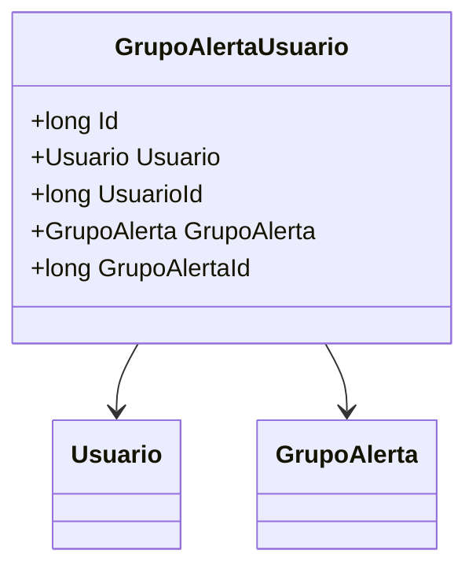

# GrupoAlertaUsuario
**Namespace**: IsthmusWinthor.Dominio.Entidades  
**Nome do Arquivo**: GrupoAlertaUsuario.cs  

## Visão Geral e Responsabilidade
A classe `GrupoAlertaUsuario` representa a associação entre um usuário e um grupo de alerta na aplicação. Ela estabelece uma relação de pertencimento, onde um usuário pode estar vinculado a um ou mais grupos de alerta. Essa relação é importante para gerenciar a configuração e o recebimento de notificações pertinentes a cada grupo, auxiliando na organização e na priorização das informações que os usuários recebem.

## Métodos de Negócio
*(Não há métodos com lógica na classe fornecida)*

## Propriedades Calculadas e de Validação
*(Não há propriedades com lógica no `get` ou validação no `set` na classe fornecida)*

## Navigations Property
- [Usuario](Usuario.md)
- [GrupoAlerta](GrupoAlerta.md)

## Tipos Auxiliares e Dependências
*(Não há enumeradores ou classes estáticas/helpers utilizadas nesta classe)*

## Diagrama de Relacionamentos

---
Gerada em 29/12/2025 20:36:10
