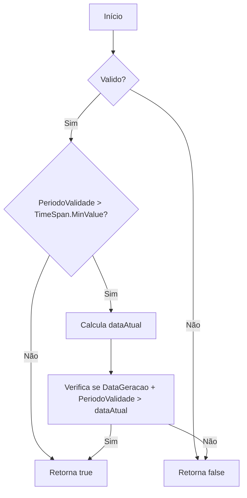
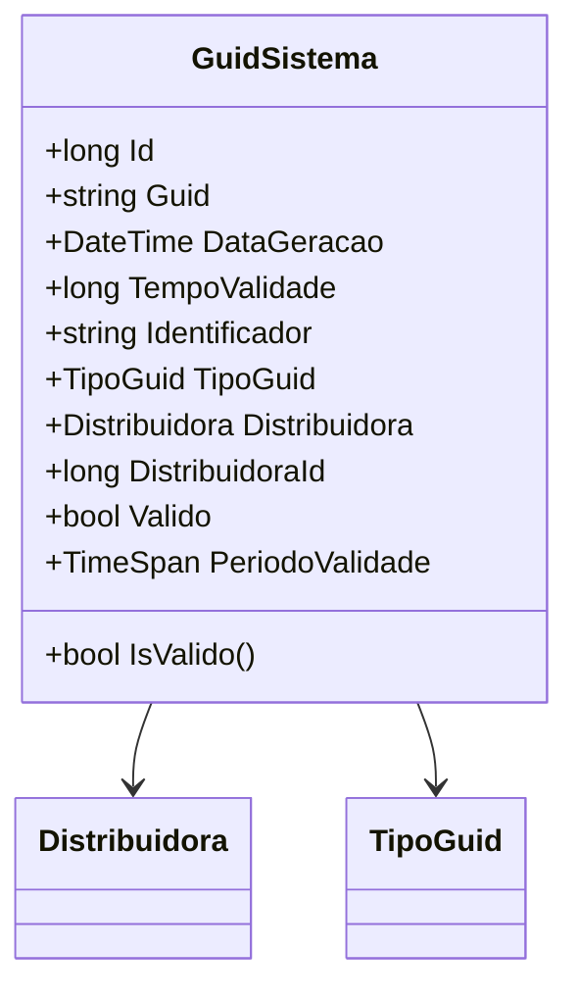

# GuidSistema

**Namespace**: IsthmusWinthor.Dominio.Entidades  
**Nome do Arquivo**: GuidSistema.cs  

## Visão Geral e Responsabilidade
A classe `GuidSistema` é responsável por gerenciar e validar identificadores únicos (GUIDs) associados a distribuidoras no sistema. Ela aborda a necessidade de garantir a unicidade e validade dos GUIDs gerados, considerando um período de validade que pode ser definido. Ao fazer isso, a classe ajuda a manter a integridade dos dados e a evitar a duplicação de identificadores que pode comprometer a lógica do negócio.

## Métodos de Negócio

### 1. IsValido() - Visibilidade: public
- **Objetivo**: Garante que o GUID é válido, considerando o estado da propriedade `Valido` e, se aplicável, a validade temporal do GUID.
- **Comportamento**:
  1. Verifica se a propriedade `Valido` é falsa. Se sim, retorna `false`.
  2. Se o `PeriodoValidade` é maior que o valor mínimo (`TimeSpan.MinValue`), calcula a data atual considerando o fuso horário do sistema.
  3. Compara a data de geração do GUID mais o `PeriodoValidade` com a data atual. Se a data atual for posterior, retorna `false`.
  4. Caso contrário, retorna `true`, indicando que o GUID ainda é válido.
- **Retorno**: Retorna um booleano que indica se o GUID é válido (`true` ou `false`).

## Propriedades Calculadas e de Validação

### 1. PeriodoValidade
- **Regra**: A propriedade `PeriodoValidade` é calculada a partir do valor `TempoValidade` em ticks, proporcionando uma visualização do tempo de validade em um formato de `TimeSpan`. Essa propriedade é usada para verificar se o `GuidSistema` ainda é válido considerando a data de geração e o período de validade definido.

## Navigation Property

### 1. Distribuidora
- Esta propriedade representa uma associação com a classe complexa que encapsula as informações de distribuidora. O arquivo presumido é: [Distribuidora](Distribuidora.md).

## Tipos Auxiliares e Dependências
- **Enumeradores**: 
  - [TipoGuid](TipoGuid.md)
- **Classes estáticas**: 
  - [DateTimeUtil](DateTimeUtil.md)

## Diagrama de Relacionamentos

---
Gerada em 29/12/2025 20:36:28
