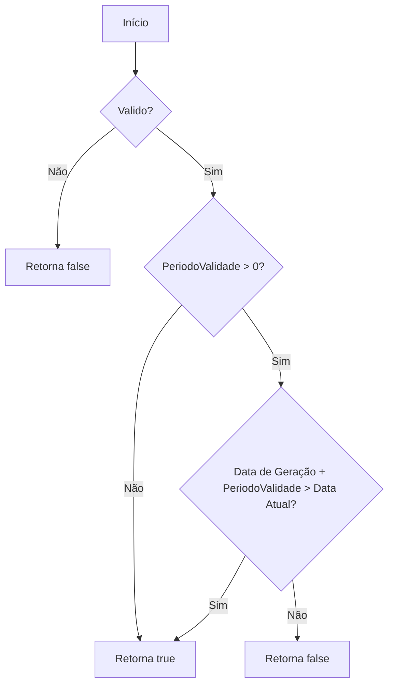
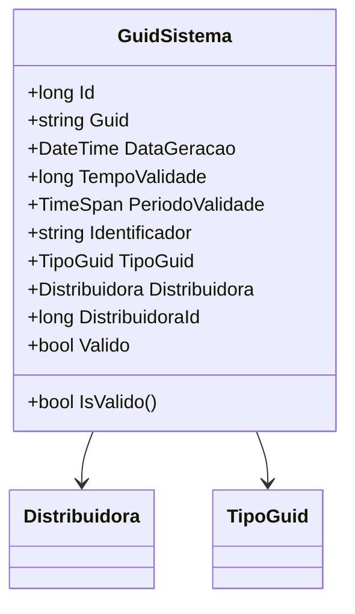

# GuidSistema

**Namespace**: IsthmusWinthor.Dominio.Entidades  
**Nome do Arquivo**: GuidSistema.cs

## Visão Geral e Responsabilidade
A classe `GuidSistema` representa um identificador único gerado para uma distribuidora, com controle sobre sua validade no tempo. Este modelo é essencial para garantir que os identificadores sejam válidos durante o período definido e serve para evitar problemas de duplicidade e expiração não controlada de GUIDs. Isso é especialmente importante em sistemas onde a integridade e a unicidade dos dados são fundamentais.

## Métodos de Negócio

### Título: `IsValido` (public)
- **Objetivo**: Este método verifica se o GUID é considerado válido, levando em consideração sua validade e o período de validade associado.
- **Comportamento**: 
  1. Verifica se a propriedade `Valido` é `false`. Se sim, retorna `false`.
  2. Se `PeriodoValidade` for maior que `TimeSpan.MinValue`, valida a duração, comparando a data de geração mais o período de validade com a data atual.
  3. Se ainda não estiver expirado, retorna `true`.
  4. Se o período de validade não for definido, assume que o GUID é sempre válido.
- **Retorno**: Retorna um valor booleano que indica se o GUID é válido no momento da verificação.

## Propriedades Calculadas e de Validação
### Propriedade: `PeriodoValidade`
- **Regra**: Retorna o `TimeSpan` representando a validade do GUID, calculado a partir da propriedade `TempoValidade` em ticks. Isso assegura que a validade seja interpretada corretamente em unidades de tempo.

## Navigation Property
- `[Distribuidora](Distribuidora.md)`: Representa a associação desta classe com a classe `Distribuidora`, indicando que cada `GuidSistema` está efetivamente vinculado a uma distribuidora específica.

## Tipos Auxiliares e Dependências
- `[TipoGuid](TipoGuid.md)`: Enum que representa os diferentes tipos de GUID que podem ser gerados.
- `[DateTimeUtil](DateTimeUtil.md)`: Classe utilitária que fornece funções para o manejo de data e hora.

## Diagrama de Relacionamentos

