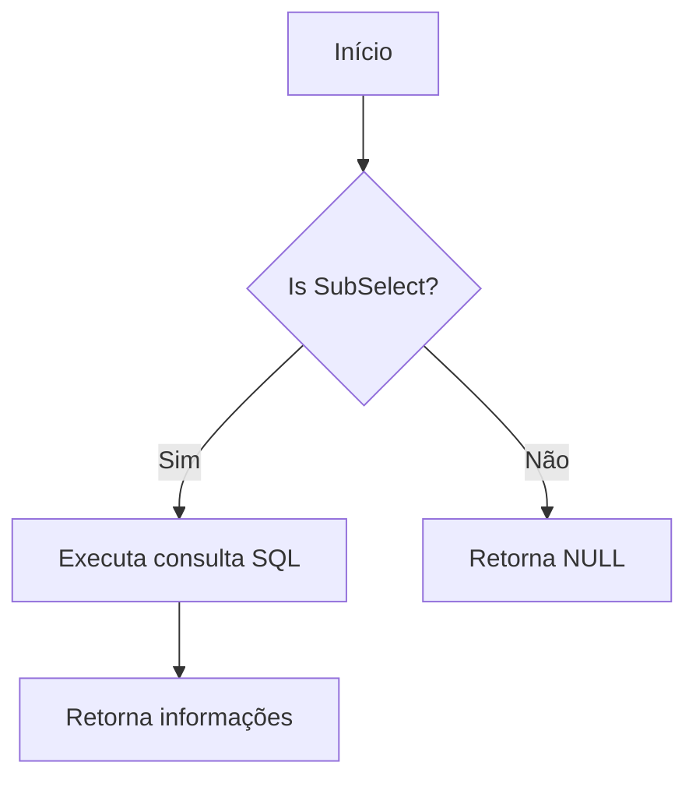
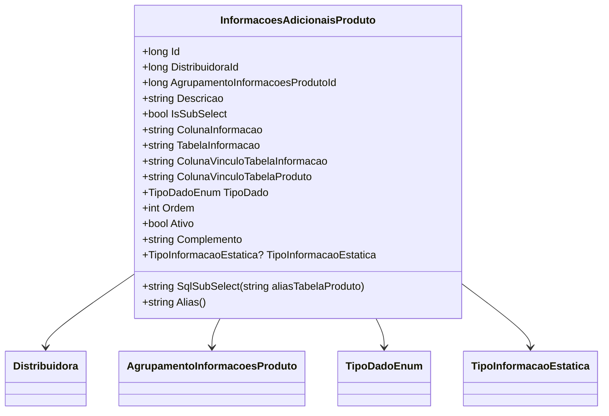

# InformacoesAdicionaisProduto
- **Namespace**: IsthmusWinthor.Dominio.Entidades
- **Nome do Arquivo**: InformacoesAdicionaisProduto.cs

## Visão Geral e Responsabilidade
A classe `InformacoesAdicionaisProduto` representa informações adicionais relacionadas a produtos dentro de um sistema de informações. Ela permite a vinculação de informações de produtos a distribuidores, bem como agrupa essas informações em categorias. Isso é vital para a apresentação e acesso a dados complexos em um contexto de vendas ou estoque, onde múltiplas fontes e tipos de dados podem ser integrados. 

## Métodos de Negócio

### Title: SqlSubSelect (public)
- **Objetivo**: Este método gera uma consulta SQL que retorna informações adicionais de um subselect, vinculado a um produto específico, considerando as colunas definidas.
- **Comportamento**: 
  1. O método recebe como parâmetro `aliasTabelaProduto`, que é um alias para a tabela de produtos.
  2. Constrói uma string SQL que tenta recuperar informações da tabela especificada em `TabelaInformacao`.
  3. Filtro é aplicado usando `ColunaVinculoTabelaInformacao` para relacionar com a tabela de produtos.
  4. Utiliza a função `COALESCE` para retornar `NULL` caso não haja registros válidos.
  5. O resultado da consulta será retornado com um alias gerado pelo método `Alias`.
  

### Title: Alias (public)
- **Objetivo**: Gera um alias único para a informação adicional com base no ID.
- **Comportamento**: Retorna uma string que combina a palavra "InfoAdic_" com o `Id` da instância atual da classe.
- **Retorno**: O valor retornado é uma string que serve como um identificador único para a informação adicional.

## Propriedades Calculadas e de Validação
- **ColunaInformacao**: A propriedade deve ser validada para garantir que sua utilização seja adequada, principalmente quando `IsSubSelect` é verdadeiro. Isso assegura que a coluna referenciada exista no contexto correto de subselect.
- **TipoDado**: Esta propriedade determina o tipo de dado utilizado, garantindo que as informações sejam manipuladas corretamente de acordo com sua natureza, o que pode impactar na apresentação e no uso dos dados em operações de banco.

## Navigations Property
- `[Distribuidora](Distribuidora.md)`: Representa a distribuidora relacionada à informação adicional.
- `[AgrupamentoInformacoesProduto](AgrupamentoInformacoesProduto.md)`: Representa o agrupamento ao qual esta informação adicional pertence.

## Tipos Auxiliares e Dependências
- `[TipoDadoEnum](TipoDadoEnum.md)`: Enumeração que especifica os tipos de dados para a informação adicional.
- `[TipoInformacaoEstatica](TipoInformacaoEstatica.md)`: Enumeração que indica se a informação é estática ou dinâmica.

## Diagrama de Relacionamentos

