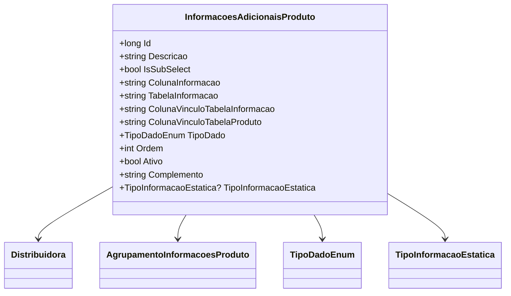

# InformacoesAdicionaisProduto
- **Namespace**: IsthmusWinthor.Dominio.Entidades
- **Nome do Arquivo**: InformacoesAdicionaisProduto.cs

## Visão Geral e Responsabilidade
A classe `InformacoesAdicionaisProduto` é um modelo de domínio que representa informações adicionais relacionadas a um produto na aplicação. Ela é responsável por gerenciar a forma como dados adicionais são consultados e exibidos, especialmente no contexto de subconsultas que podem envolver diferentes tabelas e colunas. Isso resolve o problema de necessidade de flexibilidade na extração de informações que não estão diretamente nos dados principais do produto.

## Métodos de Negócio

### Title: SqlSubSelect - Public
- **Objetivo:** Gera uma subconsulta SQL para obter a informação desejada de uma tabela específica, dependendo se é uma subselect ou não.
- **Comportamento:**
  1. Se `IsSubSelect` for verdadeiro, monta uma subconsulta que se conecta à tabela definida em `TabelaInformacao` utilizando o vinculo da coluna informada.
  2. Executa a query utilizando o alias da tabela de produto fornecido como parâmetro.
  3. Se a informação não existir, retorna `NULL`.
- **Retorno:** Retorna uma string de consulta SQL que pode ser utilizada para obter informações na base de dados.

```mermaid
flowchart TD
    A[IsSubSelect] -->|true| B[SELECT colunaInformacao FROM TabelaInformacao]
    A -->|false| C[COALESCE(informacao, NULL)]
    B --> D[WHERE colunaVinculoTabelaInformacao = aliasTabelaProduto.colunaVinculoTabelaProduto]
    C --> E[Return: SQL Statement]
```

### Title: Alias - Public
- **Objetivo:** Gera um alias único para a instância da classe que pode ser utilizado em consultas SQL.
- **Comportamento:**
  1. Retorna uma string formatada com a prefixação "InfoAdic_" seguida pelo `Id`.
- **Retorno:** Muitos elementos que compartilham esse alias podem ser facilmente referenciados na consulta.

## Propriedades Calculadas e de Validação
- **TipoDado:** Representa o tipo de dados da informação adicional. Dependendo do tipo, diferentes operações podem ser realizadas ou regras podem ser aplicadas.
- **Ordem:** Define a ordem em que as informações adicionais devem ser apresentadas. Isso garante uma organização visual na interface do usuário.

## Navigations Property
- [Distribuidora](Distribuidora.md): Representa a distribuidora associada ao produto.
- [AgrupamentoInformacoesProduto](AgrupamentoInformacoesProduto.md): Denota o agrupamento das informações adicionais relacionadas ao produto.

## Tipos Auxiliares e Dependências
- [TipoDadoEnum](TipoDadoEnum.md): Enumeração que define os tipos de dados admitidos para as informações adicionais.
- [TipoInformacaoEstatica](TipoInformacaoEstatica.md): Enumeração que classifica se a informação é dinâmica ou estática.

## Diagrama de Relacionamentos

---
Gerada em 29/12/2025 20:36:48
