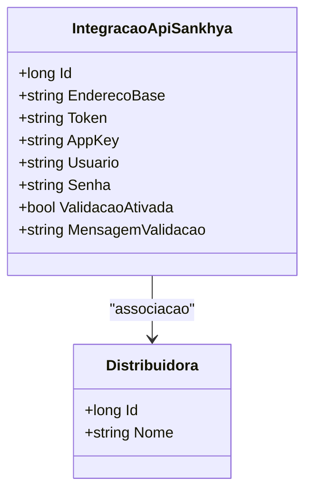

# IntegracaoApiSankhya
- **Namespace**: IsthmusWinthor.Dominio.Entidades
- **Nome do Arquivo**: IntegracaoApiSankhya.cs

## Visão Geral e Responsabilidade
A classe `IntegracaoApiSankhya` representa uma entidade que gerencia a integração com a API de um sistema externo, especificamente o Sankhya. O problema de negócio que ela resolve é facilitar a comunicação e a troca de dados entre o sistema da distribuidora e a API do Sankhya, garantindo que as informações da distribuidora possam ser validadas e transmitidas de forma segura e eficaz.

## Métodos de Negócio
- **Título:** (não há métodos com lógica de negócio nesta classe)

## Propriedades Calculadas e de Validação
- **MensagemValidacao**: Esta propriedade é utilizada para transmitir informações sobre o estado da validação da integração. Sua lógica deve garantir que, quando `ValidacaoAtivada` for verdadeira, a propriedade contenha informações relevantes sobre as validações que foram executadas.

## Navigations Property
- **Distribuidora**: classe que representa uma distribuidora associada à integração. 
  - [Distribuidora](Distribuidora.md)

## Tipos Auxiliares e Dependências
- **IEntidade**: Interface que a classe implementa, representando uma entidade do domínio.
  
## Diagrama de Relacionamentos

