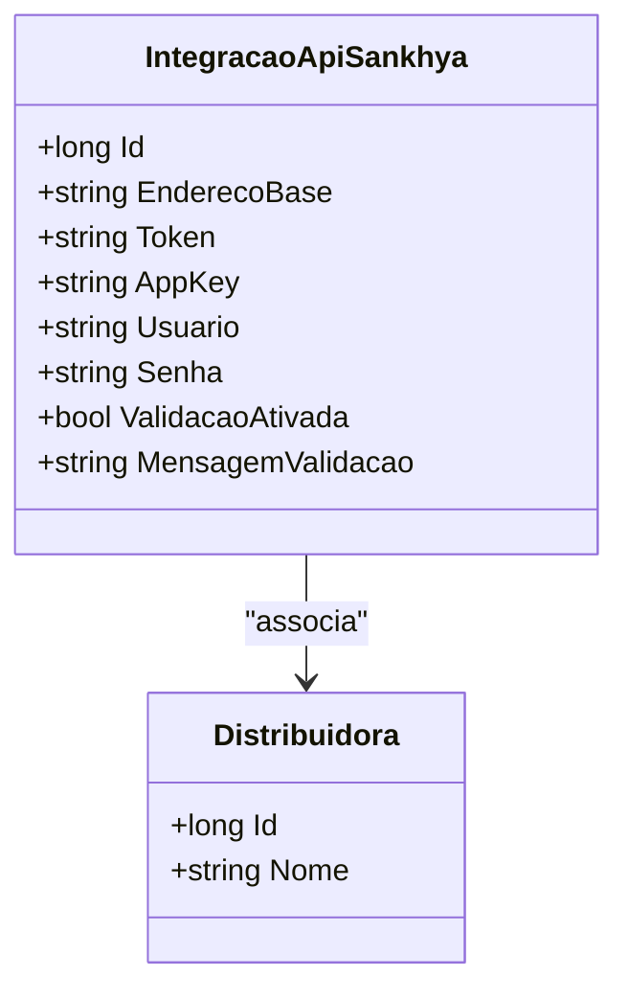

# IntegracaoApiSankhya
**Namespace**: IsthmusWinthor.Dominio.Entidades  
**Nome do Arquivo**: IntegracaoApiSankhya.cs  

## Visão Geral e Responsabilidade
A classe `IntegracaoApiSankhya` representa a configuração necessária para a comunicação com a API do sistema Sankhya. Seu papel é armazenar e validar informações relevantes, incluindo credenciais e endpoints, assegurando que a integração com a API aconteça de forma segura e eficiente. O problema de negócio que ela resolve é a necessidade de conectar sistemas externos (como o Sankhya) a um sistema interno, garantindo que as informações sejam trocadas corretamente e sem falhas de autenticação.

## Métodos de Negócio
(No momento, a classe não apresenta métodos com lógica de negócios implementados, portanto, essa seção estará vazia.)

## Propriedades Calculadas e de Validação
- `EnderecoBase`:
  - Essa propriedade deve conter a URL base da API do Sankhya, e sua validade deve ser garantida através de lógica no `set`, que poderia verificar se a URL é bem formada.
  
- `Token`, `AppKey`, `Usuario`, `Senha`:
  - Estas propriedades são essenciais para autenticação na API e podem necessitar de validações para garantir que não estão vazias e seguem padrões esperados de segurança.

## Navigations Property
- [Distribuidora](Distribuidora.md): Representa a distribuidora associada à integração, que é uma entidade complexa do domínio.

## Tipos Auxiliares e Dependências
- IEntidade: Interface que a classe `IntegracaoApiSankhya` implementa, servindo como um contrato para entidades do domínio.
  
## Diagrama de Relacionamentos

---
Gerada em 29/12/2025 20:36:57
