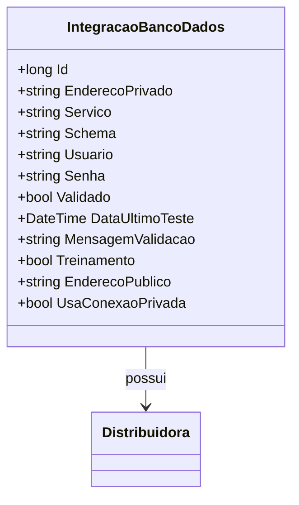

# IntegracaoBancoDados
**Namespace**: IsthmusWinthor.Dominio.Entidades  
**Nome do Arquivo**: IntegracaoBancoDados.cs  

## Visão Geral e Responsabilidade
A classe `IntegracaoBancoDados` representa uma entidade do domínio responsável por gerir as configurações e parâmetros necessários para a integração com um banco de dados. Ela mantém informações críticas, como credenciais, endereços de conexão e o estado de validação da integração. O papel dessa classe é garantir que a conexão com o banco de dados seja devidamente validada antes de ser utilizada, minimizando erros em operações de integração e assegurando a segurança dos dados.

## Métodos de Negócio
*Esta classe não possui métodos com lógica de negócios complexa, então não há documentação adicional necessária neste segmento.*

## Propriedades Calculadas e de Validação
*Não há propriedades com lógica no `get` ou validação no `set`, então não há documentação adicional necessária neste segmento.*

## Navigation Property
- [Distribuidora](Distribuidora.md)

## Tipos Auxiliares e Dependências
*Não há Enumeradores ou Classes Estáticas/Helpers utilizadas pela classe, então não há documentação adicional necessária neste segmento.*

## Diagrama de Relacionamentos

---
Gerada em 29/12/2025 20:37:06
