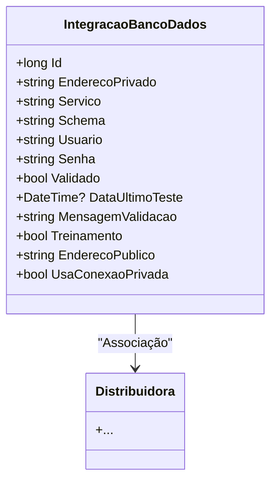

# IntegracaoBancoDados
**Namespace**: IsthmusWinthor.Dominio.Entidades  
**Nome do Arquivo**: IntegracaoBancoDados.cs  

## Visão Geral e Responsabilidade
A classe `IntegracaoBancoDados` representa a configuração e o estado de uma integração com um banco de dados em um sistema corporativo. Sua principal responsabilidade é garantir que as informações de conexão (como usuário, senha, serviço, etc.) sejam armazenadas de forma estruturada e que sua validação seja realizada, assegurando que a integração funcione corretamente, o que é crucial para a comunicação eficaz entre sistemas.

## Métodos de Negócio
A classe não apresenta métodos de negócio com lógica complexa, apenas propriedades que armazenam dados.

## Propriedades Calculadas e de Validação
Nenhuma propriedade foi identificada com lógica de cálculo ou de validação.

## Navigations Property
- `[Distribuidora](Distribuidora.md)`: Representa a distribuição associada a esta integração, permitindo que várias integrações sejam vinculadas a uma entidade de distribuição.

## Tipos Auxiliares e Dependências
- Nenhum enumerador ou classe auxiliar foi identificado.

## Diagrama de Relacionamentos

