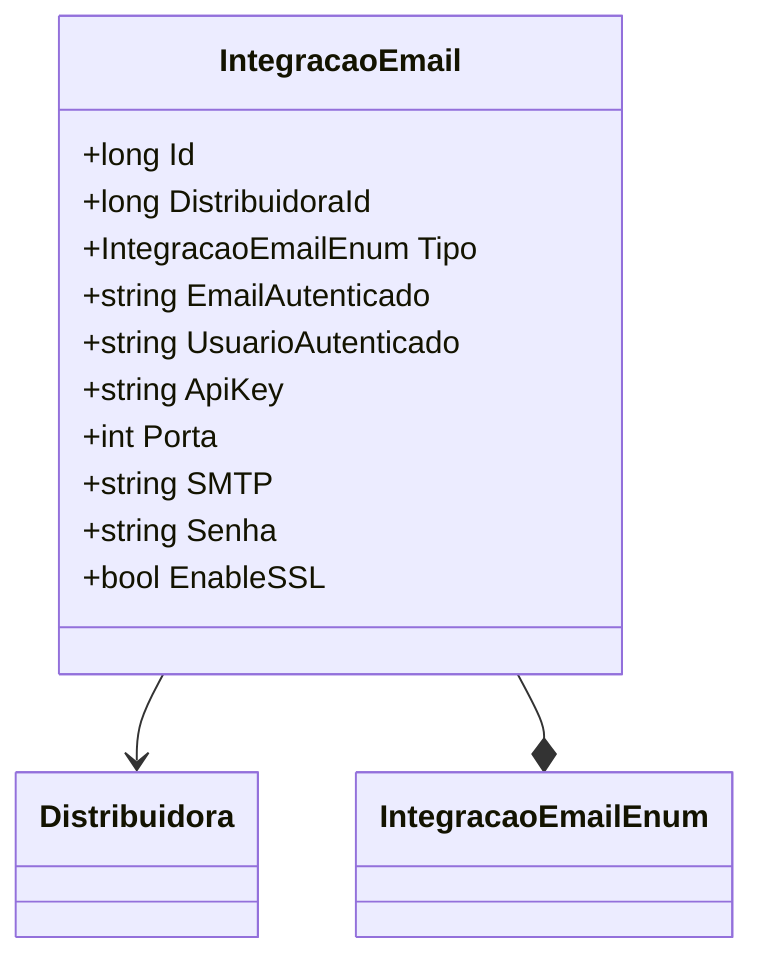

# IntegracaoEmail
- **Namespace**: IsthmusWinthor.Dominio.Entidades  
- **Nome do Arquivo**: IntegracaoEmail.cs  

## Visão Geral e Responsabilidade
A classe `IntegracaoEmail` representa uma entidade no domínio responsável por configurar e armazenar as informações necessárias para a integração de serviços de email dentro do sistema corporativo. Essa classe resolve o problema de gerenciamento centralizado das credenciais e configurações de envio de e-mails, garantindo a comunicação eficiente e organizada entre o sistema e serviços de email externos.

## Métodos de Negócio
A classe `IntegracaoEmail` não contém métodos de negócio com lógica complexa; suas funcionalidades são voltadas principalmente à configuração e armazenamento dos dados relacionados às integrações de email.

## Propriedades Calculadas e de Validação
- **EmailAutenticado**: Esta propriedade deve ser validada quanto ao formato do e-mail antes de ser setada, garantindo que apenas endereços válidos sejam armazenados.
  
  **Regra**: Um e-mail deve seguir o padrão de validação típico (ex: conter "@" e um domínio válido).

## Navigations Property
- `[Distribuidora](Distribuidora.md)`: Representa a distribuidora associada à integração de email.

## Tipos Auxiliares e Dependências
- `[IntegracaoEmailEnum](IntegracaoEmailEnum.md)`: Enumerador que define os tipos de integração de email disponíveis.

## Diagrama de Relacionamentos

