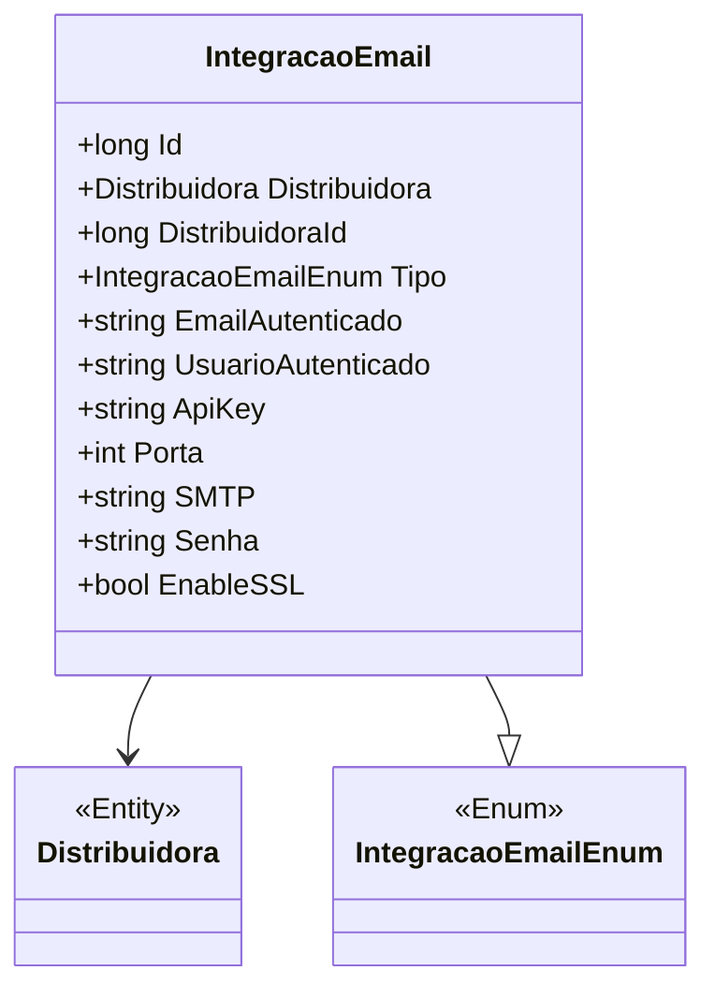

# IntegracaoEmail
**Namespace**: IsthmusWinthor.Dominio.Entidades  
**Nome do Arquivo**: IntegracaoEmail.cs  

## Visão Geral e Responsabilidade
A classe `IntegracaoEmail` representa uma entidade que gerencia as configurações de integração de e-mail de uma distribuidora. Seu principal objetivo é encapsular os dados necessários para autenticação e comunicação com um servidor SMTP para o envio de e-mails, garantindo que as informações de autenticação estejam corretamente configuradas e ativas para uso nas operações correlatas.

## Métodos de Negócio
Nenhum método de negócio complexo identificado nesta classe. Todos os métodos são simples setters e getters.

## Propriedades Calculadas e de Validação
Nenhuma propriedade com lógica de cálculo ou validação no `get` ou `set` foi identificada nesta classe.

## Navigations Property
- [Distribuidora](Distribuidora.md)

## Tipos Auxiliares e Dependências
- [IntegracaoEmailEnum](IntegracaoEmailEnum.md)

## Diagrama de Relacionamentos

---
Gerada em 29/12/2025 20:37:19
