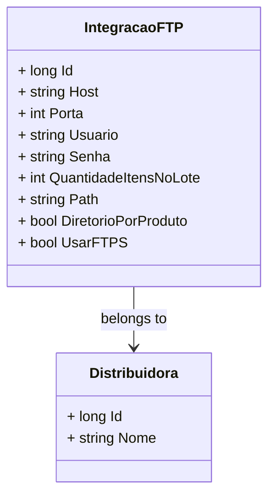

# IntegracaoFTP
**Namespace**: IsthmusWinthor.Dominio.Entidades  
**Nome do Arquivo**: IntegracaoFTP.cs  

## Visão Geral e Responsabilidade
A classe `IntegracaoFTP` representa as configurações necessárias para estabelecer uma integração via FTP para uma distribuidora. Ela encapsula informações críticas como credenciais de acesso e comportamentos de transferência de arquivos, resolvendo o problema de automação e eficiência na troca de dados entre sistemas.

## Métodos de Negócio
No momento, a classe `IntegracaoFTP` não apresenta métodos com lógica de negócios que valham uma análise detalhada, concentrando-se em ser um recipiente de propriedades essenciais para a configuração de uma integração.

## Propriedades Calculadas e de Validação
Atualmente, não existem propriedades que realizem cálculos ou contenham validações complexas no getter ou setter.

## Navigations Property
- [Distribuidora](Distribuidora.md)

## Tipos Auxiliares e Dependências
- `[PadraoNomeFotosEnum](PadraoNomeFotosEnum.md)`

## Diagrama de Relacionamentos

