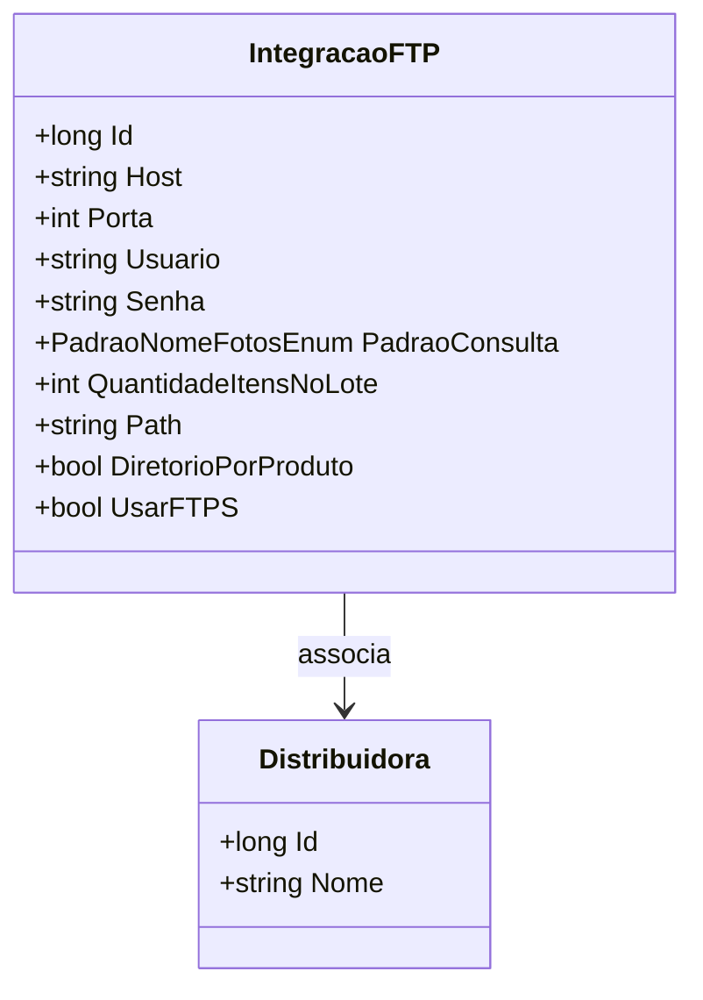

# IntegracaoFTP
- **Namespace**: IsthmusWinthor.Dominio.Entidades
- **Nome do Arquivo**: IntegracaoFTP.cs

## Visão Geral e Responsabilidade
A classe `IntegracaoFTP` é responsável por encapsular as configurações necessárias para a integração via FTP com uma distribuidora específica. Essa classe aborda um desafio comum em sistemas que precisam transferir arquivos de forma segura e eficiente, permitindo que diferentes distribuidoras tenham suas próprias configurações de acesso, como host, usuário e caminho de diretório.

## Propriedades Calculadas e de Validação
- **Usuario**: Esta propriedade não deve ser nula ou vazia. A estrutura do método de autenticação com o FTP geralmente exige credenciais.
- **Senha**: Assim como com a propriedade de usuário, a senha deve ser validada para garantir que não está vazia, uma vez que ela é essencial para a autenticação no servidor FTP.

## Navigations Property
- **Distribuidora**: [Distribuidora](Distribuidora.md) - Representa a entidade da distribuidora associada a esta integração. 

## Tipos Auxiliares e Dependências
- **PadraoNomeFotosEnum**: [PadraoNomeFotosEnum](PadraoNomeFotosEnum.md) - Enum usado para especificar o padrão do nome dos arquivos a serem consultados. 

## Diagrama de Relacionamentos

Essa documentação técnica fornece uma compreensão clara das regras de negócio em torno da classe `IntegracaoFTP`, destacando suas responsabilidades, propriedades e relacionamentos dentro do sistema.
---
Gerada em 29/12/2025 20:37:28
