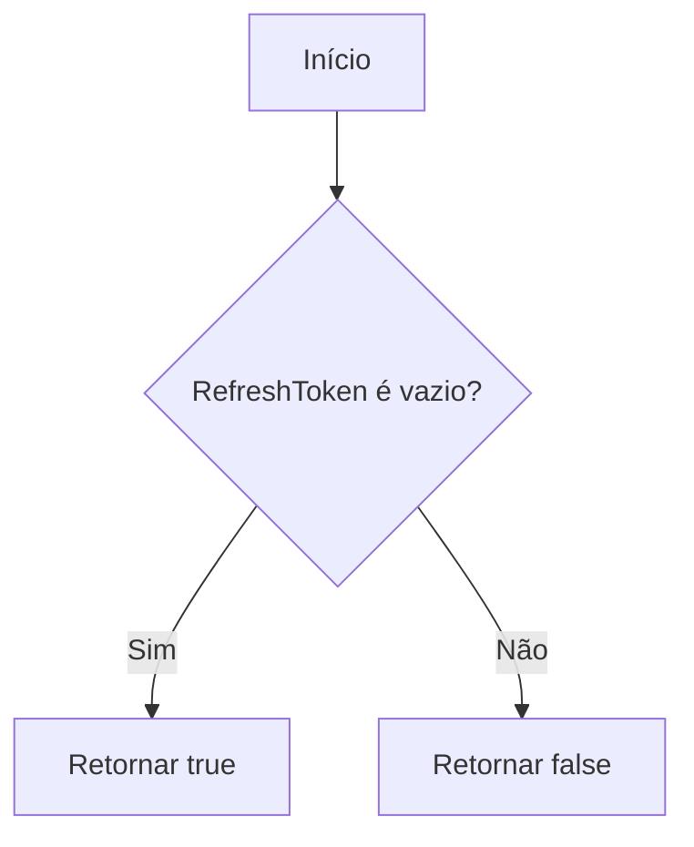
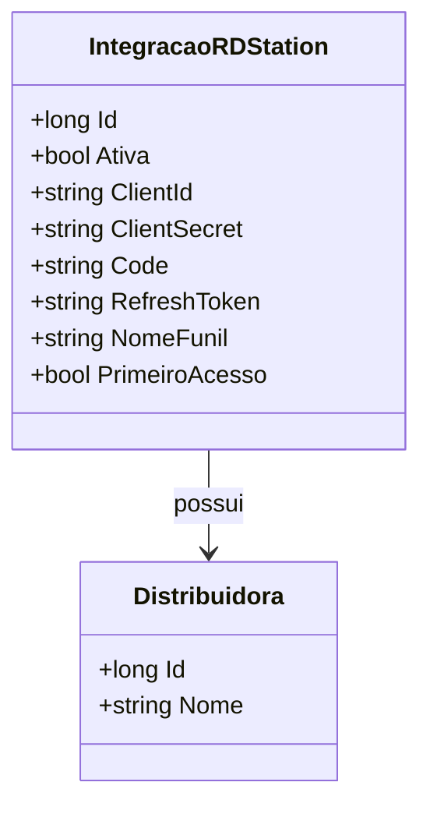

# IntegracaoRDStation
- **Namespace**: IsthmusWinthor.Dominio.Entidades
- **Nome do Arquivo**: IntegracaoRDStation.cs

## Visão Geral e Responsabilidade
A classe `IntegracaoRDStation` representa uma entidade de integração com a plataforma RD Station, permitindo que uma `Distribuidora` se conecte ao RD Station para gerenciar funis de vendas e campanhas digitais. Esta classe resolve o problema de integração de dados entre sistemas, assegurando a comunicação eficaz entre a `Distribuidora` e a plataforma de marketing.

## Métodos de Negócio
### Título: PrimeiroAcesso (Getter)
- **Objetivo**: O método garante a verificação de um estado inicial da integração com o RD Station, indicando se é o primeiro acesso do usuário ao sistema.
- **Comportamento**: 
  1. Avalia se a propriedade `RefreshToken` é nula ou vazia.
  2. Retorna `true` caso `RefreshToken` não esteja configurado, sinalizando que a distribuição ainda não foi configurada para acesso ao RD Station.
  3. Retorna `false` caso contrário, indicando que o acesso já foi realizado.
- **Retorno**: Retorna um valor booleano que sinaliza se é o primeiro acesso (`true`) ou não (`false`).

## Propriedades Calculadas e de Validação
- **PrimeiroAcesso**: Esta propriedade determina se a integração foi realizada pela primeira vez, baseando-se na presença do `RefreshToken`. Se o `RefreshToken` estiver vazio ou nulo, isso indica que a configuração inicial ainda não foi completada.

## Navigation Property
- **Distribuidora**: Uma referência à entidade complexa `[Distribuidora](Distribuidora.md)`, representando a distribuidora associada a esta integração.

## Tipos Auxiliares e Dependências
- Nenhum enumerador ou classe auxiliar externa é diretamente utilizado nesta classe.

## Diagrama de Relacionamentos

Esta documentação fornece uma visão clara sobre a entidade `IntegracaoRDStation`, suas responsabilidades nos negócios, bem como as regras que assessoram suas operações e estado.
