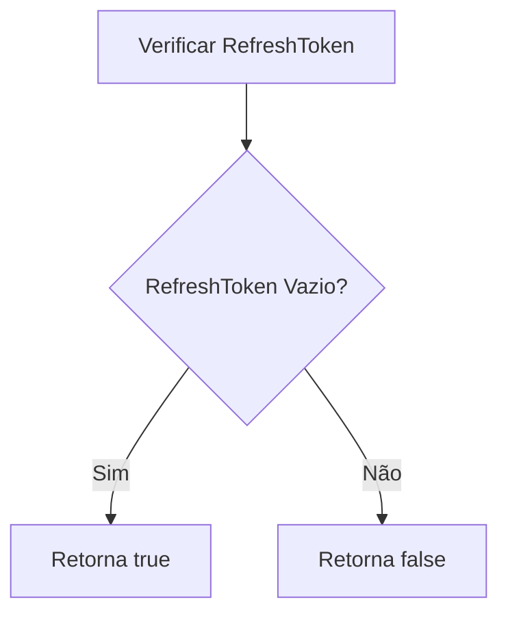
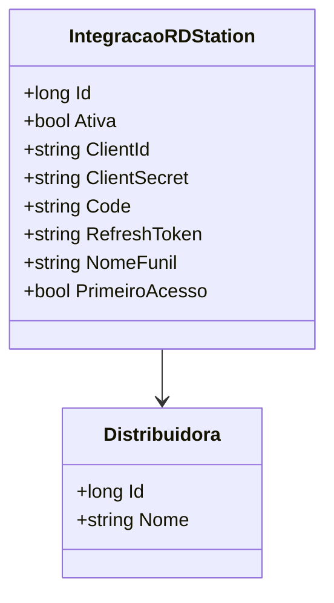

# IntegracaoRDStation
**Namespace**: IsthmusWinthor.Dominio.Entidades  
**Nome do Arquivo**: IntegracaoRDStation.cs  

## Visão Geral e Responsabilidade
A classe `IntegracaoRDStation` representa uma entidade fundamental que gerencia a integração com o serviço RD Station para uma distribuidora específica. Seu principal propósito é armazenar e gerenciar credenciais e status da integração, assegurando que as informações necessárias para a autenticação e acesso ao serviço sejam devidamente controladas, além de indicar se é o primeiro acesso da distribuidora ao sistema.

## Métodos de Negócio

### Título: PrimeiroAcesso (Public)
- **Objetivo**: Este método determina se a integração é feita pela primeira vez, verificando se o `RefreshToken` está vazio.
- **Comportamento**: 
  1. O método acessa a propriedade `RefreshToken`.
  2. Verifica se `RefreshToken` é nulo ou uma string vazia.
  3. Retorna `true` se a condição for verdadeira (indicando que é o primeiro acesso), ou `false` caso contrário.
- **Retorno**: Retorna um valor booleano (`true` ou `false`) que indica se este é o primeiro acesso da distribuidora.

## Propriedades Calculadas e de Validação

### PrimeiroAcesso
- **Regra**: A propriedade `PrimeiroAcesso` calcula se a distribuição está realizando sua primeira integração com o serviço, retornando `true` se não houver um `RefreshToken` associado, sinalizando que as credenciais precisam ser configuradas.

## Navigations Property
- **Distribuidora**: [Distribuidora](Distribuidora.md)

## Tipos Auxiliares e Dependências
- Nenhum enumerador ou classe auxiliar está explícito nesta classe.

## Diagrama de Relacionamentos

---
Gerada em 29/12/2025 20:37:40
