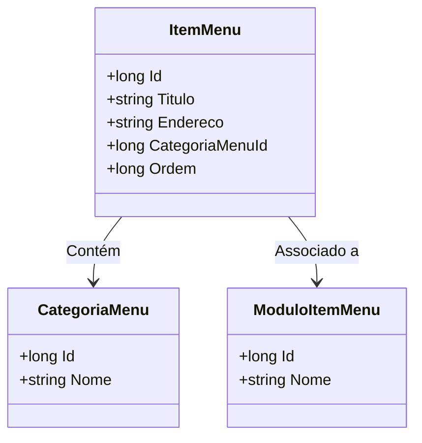

# ItemMenu
**Namespace**: IsthmusWinthor.Dominio.Entidades  
**Nome do Arquivo**: ItemMenu.cs  

## Visão Geral e Responsabilidade
A classe `ItemMenu` representa um item dentro de um menu em uma aplicação. Seu papel é gerenciar as informações relacionadas a um item específico, incluindo seu título, endereço de navegação e a categoria à qual pertence. O problema de negócio que essa classe resolve é o agrupamento e organização dos módulos que podem ser associados a cada item de menu, permitindo uma navegação coesa e intuitiva para o usuário final.

## Métodos de Negócio
### Título: Equals (override)
- **Objetivo**: Garante que a comparação entre dois itens de menu seja baseada no valor do `Id`, assegurando que dois `ItemMenu` com o mesmo `Id` sejam considerados iguais, o que é fundamental para operações de busca e manipulação no sistema.
- **Comportamento**: O método verifica se o objeto fornecido é do tipo `ItemMenu` e, em caso afirmativo, compara seu `Id` com o `Id` do item atual.
- **Retorno**: Retorna `true` se os `Id`s forem iguais, indicando que os itens são os mesmos. Caso contrário, retorna `false`.

### Título: GetHashCode (override)
- **Objetivo**: Garante que o método retorna um valor hash baseado no `Id` do item de menu, facilitando a utilização e a busca em estruturas de dados que usam hash, como `HashSet`.
- **Comportamento**: O método utiliza a função `HashCode.Combine` para gerar um valor hash que é único para cada `Id`, assegurando uma distribuição uniforme em coleções hash.
- **Retorno**: Retorna um valor hash que representa o `Id` do `ItemMenu`.

## Propriedades Calculadas e de Validação
Não há propriedades com lógica de cálculo ou validação na classe `ItemMenu`.

## Navigation Property
- `CategoriaMenu`: `[CategoriaMenu](CategoriaMenu.md)`
- `ModulosItemMenu`: `[ModuloItemMenu](ModuloItemMenu.md)`

## Tipos Auxiliares e Dependências
- Não há enumeradores ou classes estáticas necessárias para o funcionamento de `ItemMenu`.

## Diagrama de Relacionamentos

