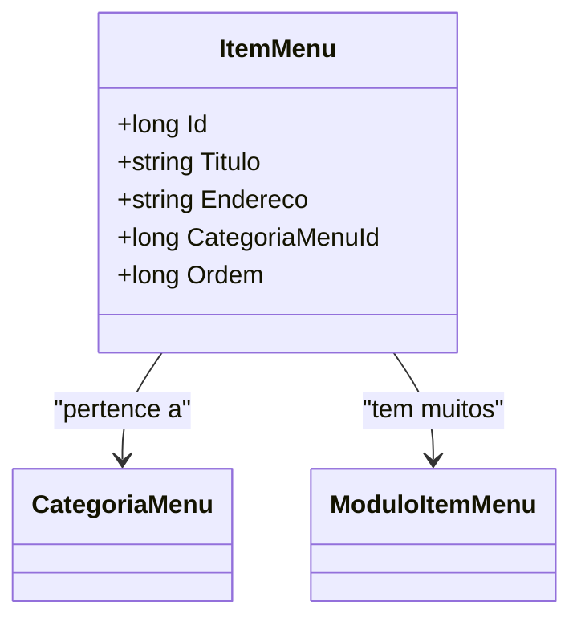

# ItemMenu
**Namespace**: IsthmusWinthor.Dominio.Entidades  
**Nome do Arquivo**: ItemMenu.cs  

## Visão Geral e Responsabilidade
A classe `ItemMenu` representa os itens que compõem um menu em um sistema. Cada item possui um título, um endereço e se relaciona a uma categoria específica do menu. A principal responsabilidade desta classe é gerenciar informações relacionadas aos itens do menu, assegurando que cada item seja corretamente identificado e posicionado em uma ordem definida. Essa estrutura é essencial para a funcionalidade de navegação do usuário dentro da interface do aplicativo.

## Métodos de Negócio
### Título: Equals | Visibilidade: public override
- **Objetivo**: Garantir que a comparação entre dois objetos do tipo `ItemMenu` seja baseada no seu identificador único (Id).
- **Comportamento**:
  1. Verifica se o objeto passado é um `ItemMenu`.
  2. Compara o Id do objeto atual com o Id do objeto comparado.
- **Retorno**: Retorna `true` se os Ids forem iguais, caso contrário, retorna `false`.

### Título: GetHashCode | Visibilidade: public override
- **Objetivo**: Prover uma representação numérica única para a instância da classe `ItemMenu`, que pode ser usada em coleções hash.
- **Comportamento**:
  1. Utiliza o método `HashCode.Combine` para gerar um hash baseado no identificador único (Id) do item do menu.
- **Retorno**: Retorna um valor hash gerado a partir do Id, utilizado para operações em estruturas de dados que utilizam hashing.

## Propriedades Calculadas e de Validação
- Nenhuma propriedade com lógica de cálculo ou validação foi identificada nesta classe.

## Navigation Property
- [CategoriaMenu](CategoriaMenu.md)
- [ModuloItemMenu](ModuloItemMenu.md)

## Tipos Auxiliares e Dependências
- Nenhum enumerador ou classes auxiliares adicionais foram identificados nesta classe.

## Diagrama de Relacionamentos

---
Gerada em 29/12/2025 20:37:51
