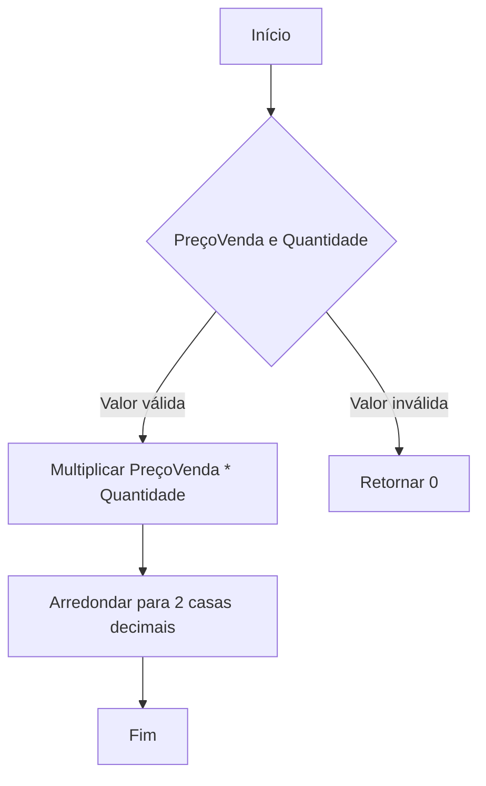
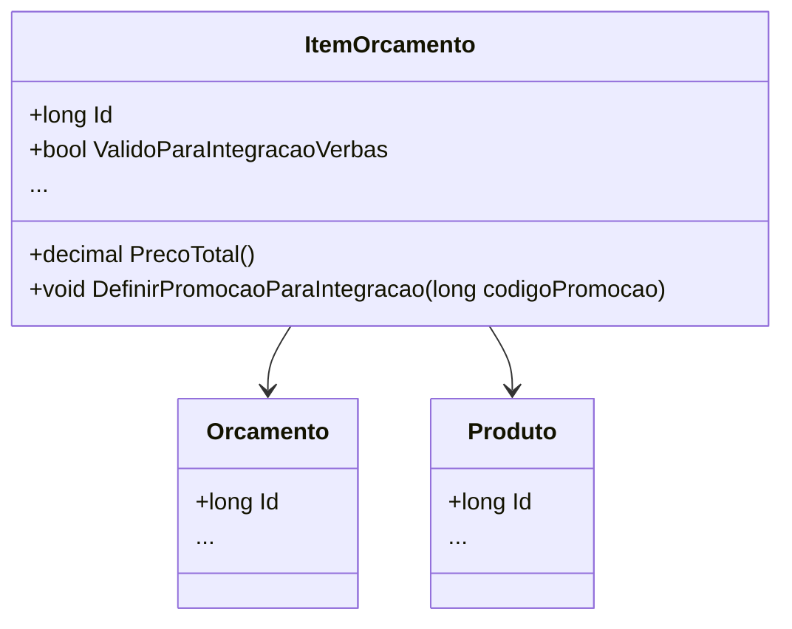

# ItemOrcamento
**Namespace**: IsthmusWinthor.Dominio.Entidades  
**Nome do Arquivo**: ItemOrcamento.cs  

## Visão Geral e Responsabilidade
A classe `ItemOrcamento` representa um item dentro de um orçamento, vinculando um produto ao orçamento e contendo informações relevantes para a sua venda, como preços e verbas (descontos ou bonificações). Ela é responsável por garantir que as regras de negócio relacionadas a verbas e preços sejam seguidas, permitindo a correta integração e cálculo de valores finais em processos de vendas.

## Métodos de Negócio

### PrecoTotal
- **Título**: `PrecoTotal` (public)
- **Objetivo**: Calcula o preço total do item com base na quantidade e no preço de venda, garantindo que o resultado esteja arredondado corretamente.
- **Comportamento**: 
  1. Multiplica o `PrecoVenda` pela `Quantidade`.
  2. Arredonda o resultado para duas casas decimais usando a regra de arredondamento "afastando do zero".
  3. Retorna o preço total arredondado.
- **Retorno**: Valor do preço total do item como um `decimal`.

### DefinirPromocaoParaIntegracao
- **Título**: `DefinirPromocaoParaIntegracao` (public)
- **Objetivo**: Define o código de promoção para o item, garantindo que a promoção só seja aplicada se o preço tiver sido alterado por verbas.
- **Comportamento**:
  1. Verifica se o método `PrecoAlteradoPeloModuloVerbas` retorna `false`; se sim, não faz nada.
  2. Se o preço foi alterado, atribui o `codigoPromocao` ao item.
- **Retorno**: Nenhum.

## Propriedades Calculadas e de Validação

### Embalagem
- **Regra**: A propriedade `Embalagem` converte um objeto `Embalagem` em JSON e vice-versa.
- **Validação**: Verifica se a string `EmbalagemJson` não está vazia antes de tentar desserializar e trata exceções que podem ocorrer.

### ValidoParaIntegracaoVerbas
- **Regra**: Determina se o item é válido para integração de verbas com base na alteração de preço e na presença de um código promocional.

### PrecoAlteradoPeloModuloVerbas
- **Regra**: Indica se o preço do item foi alterado por alguma verba, considerando bonificações ou acréscimos.

### VerbaAplicada
- **Regra**: Identifica se uma verba foi aplicada ao item, seja como desconto ou bonificação.

### VerbaBonificacaoAplicada
- **Regra**: Indica que uma bonificação foi aplicada se o percentual de verba for 100%.

### VerbaDescontoAplicado
- **Regra**: Indica que um desconto foi aplicado se o percentual de verba está entre 0 e 99,99%, garantindo que bonificação não é considerada desconto.

### AcrescimoAplicado
- **Regra**: Indica se houve um acréscimo se o percentual de verba for negativo.

### MensagemVerba
- **Regra**: Retorna uma mensagem de texto que descreve a aplicação da verba, dependendo de qual tipo de verba foi aplicada.

## Navigations Property

- **Orcamento**: [Orcamento](Orcamento.md)
- **Produto**: [Produto](Produto.md)

## Tipos Auxiliares e Dependências
- [POCO.Embalagem](POCO.Embalagem.md)
- [EnumVerba](EnumVerba.md) (presumido)

## Diagrama de Relacionamentos

