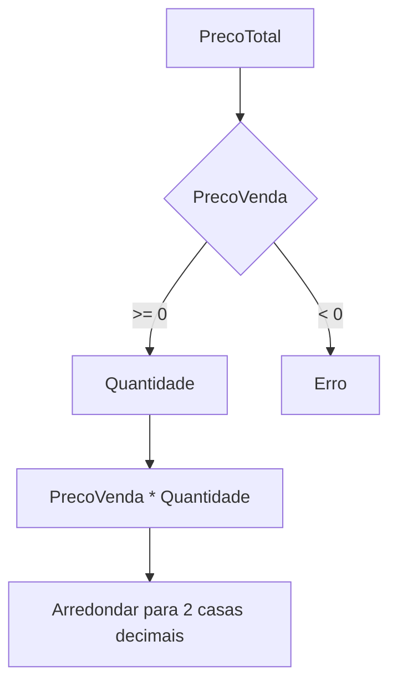
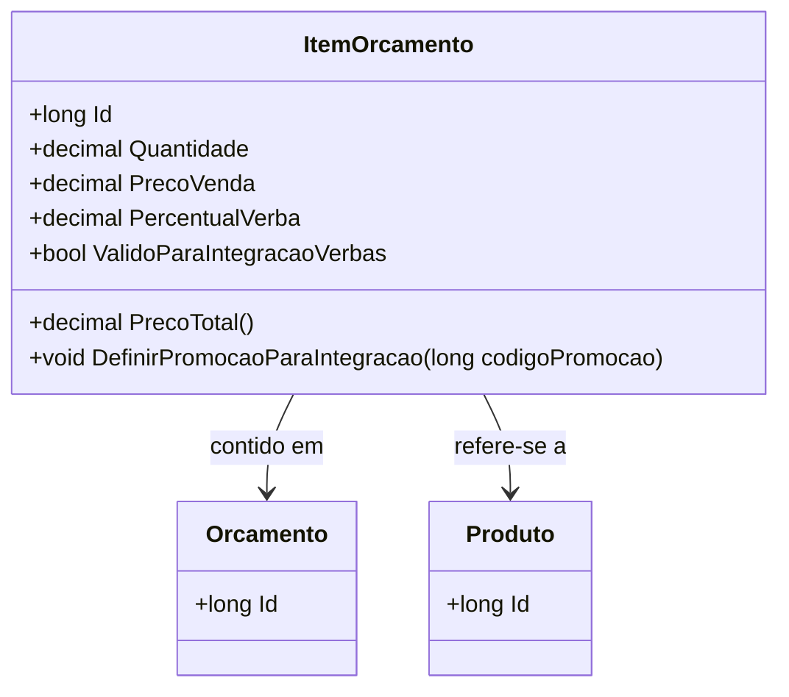

# ItemOrcamento
**Namespace**: IsthmusWinthor.Dominio.Entidades  
**Nome do Arquivo**: ItemOrcamento.cs  

## Visão Geral e Responsabilidade
A classe `ItemOrcamento` é uma representação de um item dentro de um orçamento, gerenciando a relação entre um orçamento específico e um produto. Ela é responsável por calcular valores relacionados ao preço e à quantidade do produto, bem como gerenciar regras para a aplicação de verbas e promoções. São tratadas specificidades de descontos e bonificações, assegurando a integridade dos dados financeiros através de validações lógicas.

## Métodos de Negócio

### PrecoTotal() - Público
- **Objetivo**: Garante o cálculo correto do preço total de um item orçamentário, considerando a quantidade e o preço de venda.
- **Comportamento**:
  1. Multiplica o `PrecoVenda` pela `Quantidade`.
  2. Arredonda o resultado para duas casas decimais utilizando a regra de arredondamento "AwayFromZero".
- **Retorno**: Retorna o valor total do item orçado.
  

### DefinirPromocaoParaIntegracao(long codigoPromocao) - Público
- **Objetivo**: Define um código de promoção para um item orçamentário, mas apenas se a lógica de alteração de preço estiver ativa.
- **Comportamento**:
  1. Verifica se o preço foi alterado pelo módulo de verbas.
  2. Se não houve alteração, o método finaliza a execução sem aplicar a promoção.
  3. Caso contrário, o código da promoção é definido.
- **Retorno**: Este método não retorna valor; sua execução é a alteração do estado interno da classe.

## Propriedades Calculadas e de Validação

### Embalagem
- **Cálculo**: A propriedade `Embalagem` possui um `get` que tenta desserializar um objeto JSON armazenado em `EmbalagemJson`. Se a desserialização falhar ou o JSON estiver vazio, retorna `null`. O `set` converte um objeto `Embalagem` em JSON e armazena em `EmbalagemJson`, garantindo a integridade dos dados.

### ValidoParaIntegracaoVerbas
- **Regra**: Retorna verdadeiro se a propriedade `PrecoAlteradoPeloModuloVerbas` for falsa ou se houver um código de promoção válido.

### PrecoAlteradoPeloModuloVerbas
- **Regra**: Verifica se alguma verba foi aplicada (desconto ou bonificação) e, portanto, se o preço foi alterado.

## Navigations Property
- [Orcamento](Orcamento.md)
- [Produto](Produto.md)

## Tipos Auxiliares e Dependências
- [POCO.Embalagem](POCO.Embalagem.md)

## Diagrama de Relacionamentos

---
Gerada em 29/12/2025 20:38:08
