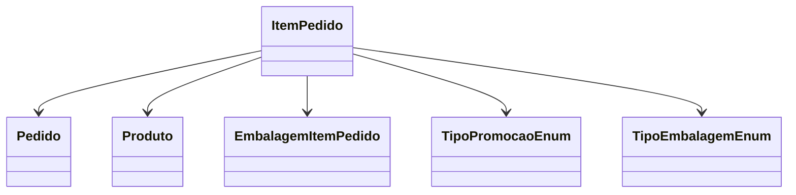

# ItemPedido

- **Namespace**: IsthmusWinthor.Dominio.Entidades
- **Nome do Arquivo**: ItemPedido.cs

## Visão Geral e Responsabilidade
A classe `ItemPedido` representa um item dentro de um pedido, gerenciando informações sobre o produto, preços e promoções aplicadas. Sua responsabilidade principal é garantir que todos os cálculos de preços e a aplicação de descontos sejam realizados corretamente, mantendo a integridade dos dados financeiros e facilitando a integração com outros sistemas.

## Métodos de Negócio

### Título: PrecoVendaTotal() - Public
**Objetivo**: Calcular o preço total do item levando em consideração a quantidade solicitada e possíveis ajustes no preço conforme a embalagem.  
**Comportamento**:
1. Chama o método `CalcularPreco` para obter o preço considerando a embalagem, se necessário.
2. Multiplica o preço obtido pela `Quantidade` do item.
3. Aplica arredondamento com base em `QuantidadeCasasDecimaisArredondamento`.
**Retorno**: O preço total do item após considerar a quantidade e ajustes.

```mermaid
flowchart TD
    A[PrecoVendaTotal()] --> B{IsEmbalagem?}
    B -- Sim --> C[Chamar CalcularPreco(PrecoVenda, ignorarEmbalagem)]
    B -- Não --> D[Chamar CalcularPreco(PrecoVenda, ignorarEmbalagem)]
    C --> E[Quantidade * C]
    D --> F[Quantidade * D]
    E --> G[Retorno do Total]
    F --> G
```

### Título: PrecoVendaUnitario() - Public
**Objetivo**: Retornar o preço unitário do item, considerando se é uma embalagem e as regras de arredondamento.  
**Comportamento**:
1. Verifica se o item é uma embalagem e, se sim, calcula o preço unitário da embalagem.
2. Caso contrário, chama `CalcularPreco` para obter o preço unitário normal.
**Retorno**: O preço unitário do item ajustado conforme necessário.

### Título: PrecoBaseUnitario() - Public
**Objetivo**: Calcular o preço base unitário, aplicando as regras de embalagem se necessário.  
**Comportamento**:
1. Assim como no método anterior, verifica se o item é uma embalagem.
2. Se for, calcula o preço unitário da embalagem; senão, retorna o preço base normal.
**Retorno**: O preço base unitário do item.

### Título: PrecoIntegracao() - Public
**Objetivo**: Calcular o preço a ser enviado para integração, considerando se é necessário enviar o preço sem impostos.  
**Comportamento**:
1. Se `EnviarPrecoVendaSemImposto` for verdadeiro, chama `ObterPrecoVendaSemImposto` para obter o valor.
2. Caso contrário, usa o `PrecoVenda` e adiciona o `ValorReducaoSimplesNacional`.
3. Verifica se o item é uma embalagem para ajustar o preço conforme a embalagem.
**Retorno**: O preço integrado formatado e arredondado.

### Título: PrecoClienteTotal() - Public
**Objetivo**: Calcular o preço total do item considerando o preço do cliente.  
**Comportamento**:
1. Chama `CalcularPreco` para obter o preço do cliente.
2. Multiplica pelo `Quantidade`, aplicando arredondamento.
**Retorno**: O total do item com base no preço do cliente.

### Título: PrecoPromocionalTotal() - Public
**Objetivo**: Calcular o preço total do item levando em consideração um preço promocional.  
**Comportamento**:
1. Chama `CalcularPreco` com o `PrecoPromocional`.
2. Multiplica o resultado pela `Quantidade` e aplica arredondamento.
**Retorno**: O total do item com base no preço promocional.

## Propriedades Calculadas e de Validação
- `QuantidadeUnitaria`: Calcula a quantidade unitária com base na embalagem selecionada. A regra é que, se o item for uma embalagem do tipo padrão, a quantidade unitária será multiplicada pela `Quantidade` solicitada.

## Navigations Property
- [Pedido](Pedido.md)
- [Produto](Produto.md)
- [EmbalagemItemPedido](EmbalagemItemPedido.md)

## Tipos Auxiliares e Dependências
- [TipoPromocaoEnum](TipoPromocaoEnum.md)
- [TipoEmbalagemEnum](TipoEmbalagemEnum.md)

## Diagrama de Relacionamentos


Esta documentação técnica fornece uma visão detalhada da classe `ItemPedido`, suas regras de negócios e como ela interage dentro do domínio de pedidos em um sistema corporativo.
---
Gerada em 29/12/2025 20:38:30
