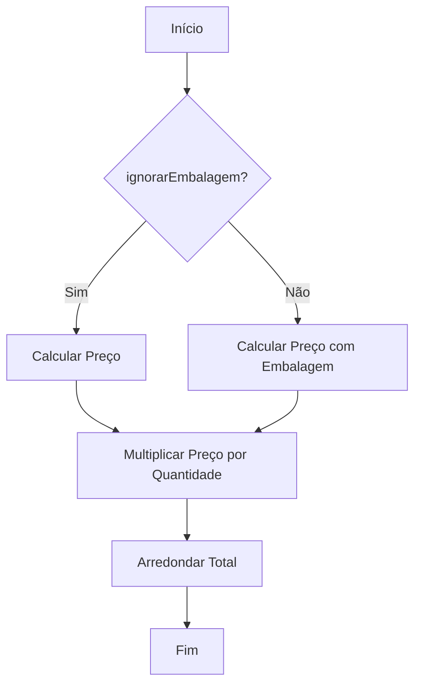
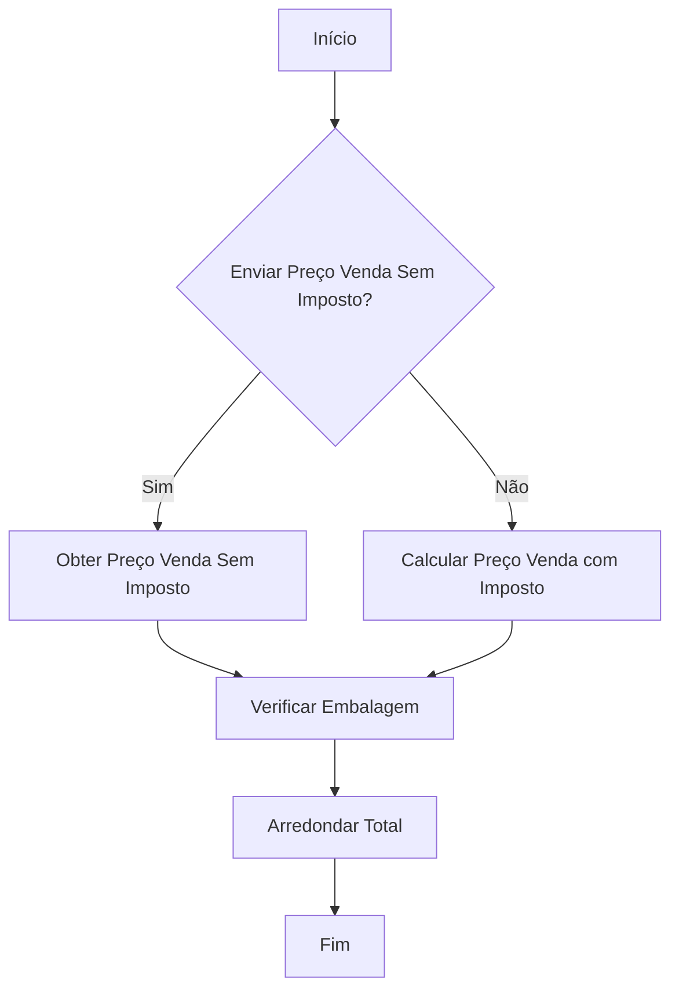
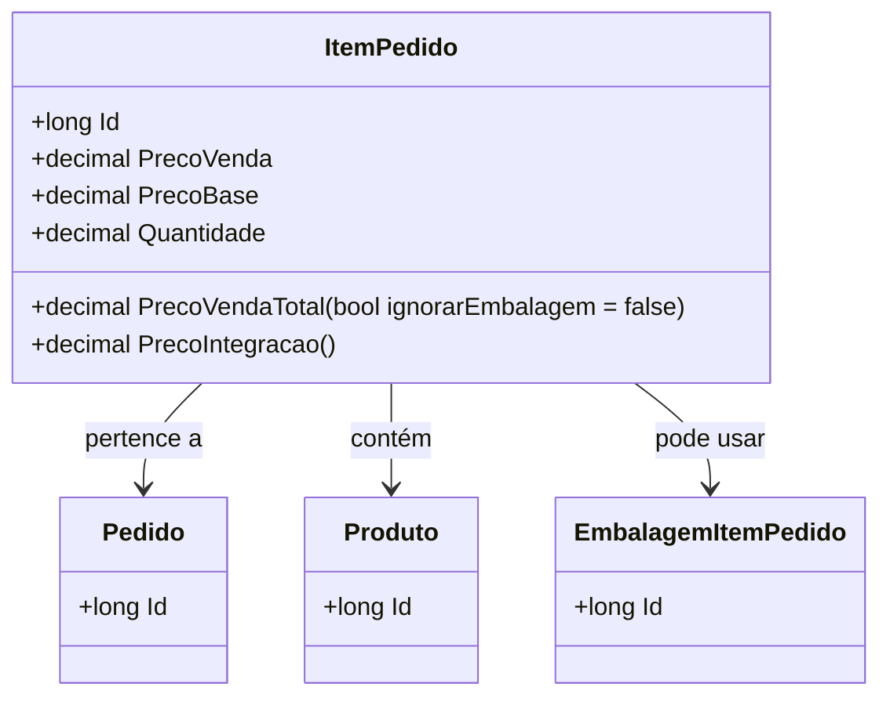

# ItemPedido

**Namespace**: IsthmusWinthor.Dominio.Entidades  
**Nome do Arquivo**: ItemPedido.cs  

## Visão Geral e Responsabilidade
A classe `ItemPedido` representa um item em um pedido dentro de um sistema de vendas. Ela é responsável por encapsular detalhes comerciais essenciais, como preços, descontos e quantidades dos produtos em um pedido, permitindo a integração de dados para cálculos e operações de faturamento. Um objetivo central dessa classe é garantir que os preços sejam corretamente calculados em função das diversas promoções e impostos aplicáveis, assegurando que a informação sempre reflita a realidade financeira da transação.

## Métodos de Negócio

### 1. Método: `PrecoVendaTotal(bool ignorarEmbalagem = false)`
- **Visibilidade**: Public
- **Objetivo**: Calcular o valor total do item considerando a quantidade e o preço de venda.
- **Comportamento**: 
  1. Chama o método `CalcularPreco` com o preço de venda, podendo ignorar os fatores da embalagem.
  2. Multiplica o preço resultante pela quantidade.
  3. Arredonda o resultado de acordo com o número de casas decimais definido.
- **Retorno**: O valor total do item, arredondado conforme as regras de arredondamento definidas.

### 2. Método: `PrecoIntegracao()`
- **Visibilidade**: Public
- **Objetivo**: Determinar o preço do item que deve ser enviado para a integração, considerando impostos e possíveis configurações de embalagem.
- **Comportamento**: 
  1. Avalia se o preço de venda deve ser enviado sem imposto.
  2. Caso negativo, obtém o preço de venda e adiciona o valor da redução do Simples Nacional.
  3. Se o item for embalagem, calcula o preço com as especificações da embalagem.
  4. Retorna o preço arredondado.
- **Retorno**: O preço que será enviado para processamento externo, arredondado conforme as regras de arredondamento definidas.

## Propriedades Calculadas e de Validação
- **QuantidadeUnitaria**: Retorna a quantidade unitária correta com base no tipo de embalagem, multiplicando a quantidade por uma fração específica se necessário. A lógica reflete a estrutura do pedido, garantindo que o cliente pague pelo volume correto de produto.

## Navigation Property
- [`Pedido`](Pedido.md): Representa o pedido ao qual este item pertence.
- [`Produto`](Produto.md): Representa o produto que está sendo vendido.
- [`EmbalagemItemPedido`](EmbalagemItemPedido.md): Representa detalhes da embalagem se o item vendido for uma embalagem.

## Tipos Auxiliares e Dependências
- [`TipoPromocaoEnum`](TipoPromocaoEnum.md): Enum que define os tipos de promoção aplicados aos itens.
- [`TipoEmbalagemEnum`](TipoEmbalagemEnum.md): Enum que classifica os diferentes tipos de embalagem.

## Diagrama de Relacionamentos

