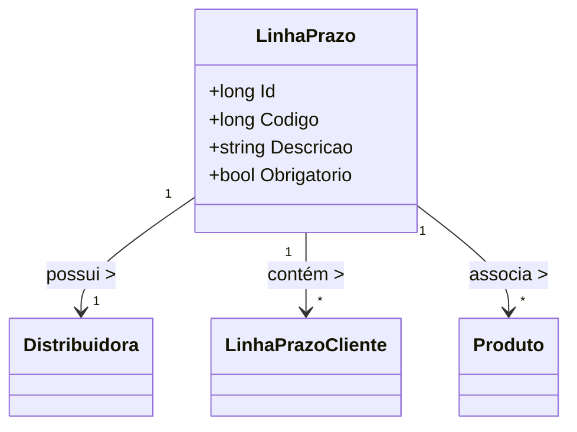

# LinhaPrazo
**Namespace**: IsthmusWinthor.Dominio.Entidades  
**Nome do Arquivo**: LinhaPrazo.cs  

## Visão Geral e Responsabilidade
A classe `LinhaPrazo` é um componente central na modelagem de prazos associados a distribuidoras. Ela representa uma linha que define prazos específicos que podem ser aplicados a produtos e clientes. O seu propósito de negócio é assegurar que as regras referentes a prazos obrigatórios e suas associações com distribuidoras e produtos sejam respeitadas, facilitando o controle de condições comerciais entre os participantes do sistema.

## Métodos de Negócio
(Atualmente, a classe não apresenta métodos com lógica de negócio, todos os seus métodos evidentes são conformes a propriedades assumidas.)

## Propriedades Calculadas e de Validação
- **Descrição**: embora a descrição seja uma propriedade simples, ela deve ser validada em um cenário de aplicação onde uma descrição não pode ser vazia ou nula, dependendo das regras de negócio.
- **Obrigatorio**: esta propriedade booleana deve ser verificada para determinar se a linha de prazo deve ser obrigatória em termos de aplicações práticas. 

## Navigations Property
- [Distribuidora](Distribuidora.md)
- [LinhaPrazoCliente](LinhaPrazoCliente.md)
- [Produto](Produto.md)

## Tipos Auxiliares e Dependências
- Nenhum enumerador ou classe estática/helper é utilizado diretamente por esta classe.

## Diagrama de Relacionamentos

---
Gerada em 29/12/2025 20:38:41
