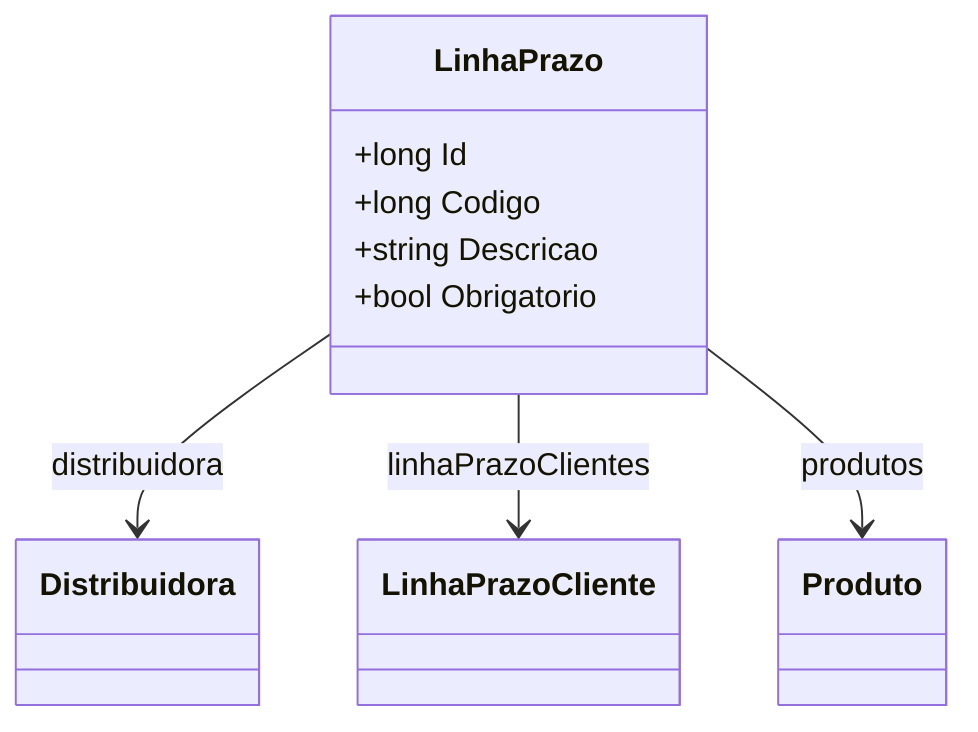

# LinhaPrazo
**Namespace**: IsthmusWinthor.Dominio.Entidades  
**Nome do Arquivo**: LinhaPrazo.cs  

## Visão Geral e Responsabilidade
A classe `LinhaPrazo` atua como uma entidade no domínio que representa uma linha temporal obrigatória ou opcional dentro de um contexto comercial. Ela gerencia informações relacionadas a prazos específicos, como descrição e utilização pela distribuidora. Esta classe é fundamental para garantir que as regras de negócio associadas a produtos e clientes em relação a prazos sejam aplicadas corretamente, possibilitando que a aplicação atenda às necessidades de planejamento e comunicação entre distribuidoras e seus clientes.

## Métodos de Negócio
- **Título:** Não há métodos adicionais com lógica condicional complexa nesta classe.

## Propriedades Calculadas e de Validação
- **Propriedade:** `Obrigatorio`
  - **Regra:** Indica se a linha de prazo é obrigatória ou não. Essa propriedade deve ser validada para garantir que os prazos essenciais sejam sempre respeitados na lógica de negócios, impactando diretamente a operação.

## Navigation Property
- **Distribuidora**: Representa a distribuidora associada a esta linha de prazo. 
  - Relacionamento: `[Distribuidora](Distribuidora.md)`
- **LinhaPrazoClientes**: Representa os clientes associados a esta linha de prazo.
  - Relacionamento: `[LinhaPrazoCliente](LinhaPrazoCliente.md)`
- **Produtos**: Representa os produtos que estão vinculados a esta linha de prazo.
  - Relacionamento: `[Produto](Produto.md)`

## Tipos Auxiliares e Dependências
- **Enum Dependente**: Nenhum enum é utilizado diretamente nesta classe.
- **Classes de Helper**: Nenhuma classe estática de helper é referenciada diretamente. 

## Diagrama de Relacionamentos

