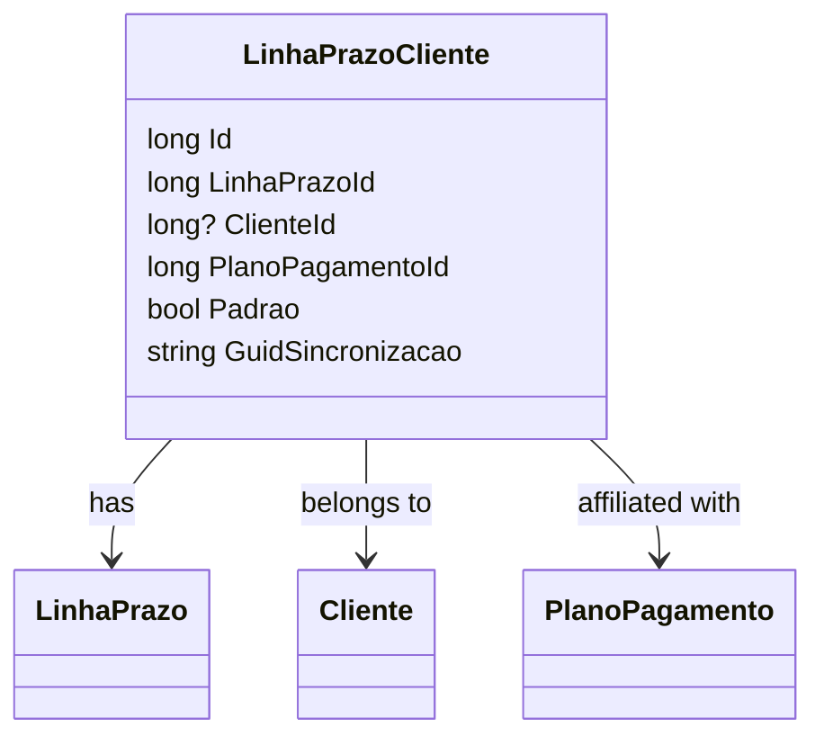

# LinhaPrazoCliente
**Namespace**: IsthmusWinthor.Dominio.Entidades  
**Nome do Arquivo**: LinhaPrazoCliente.cs  

## Visão Geral e Responsabilidade
A classe `LinhaPrazoCliente` atua como uma entidade que representa a associação entre um cliente e uma linha de prazo de pagamento. Ela é responsável por mapear as regras de relacionamento que definem como um cliente interage com os planos de pagamento associados a diferentes prazos. Essa classe resolve o problema de gerenciamento de pagamentos e associações que podem existir entre clientes e as respectivas condições de pagamento que se aplicam a eles.

## Métodos de Negócio
- **Título**: (Não há métodos de negócio com lógica definida além dos simples getters/setters)

## Propriedades Calculadas e de Validação
- **GuidSincronizacao**: Esta propriedade é utilizada para armazenar um identificador único (guid) que garante a sincronização entre diferentes sistemas. A ausência de um valor nesta propriedade pode indicar que a entidade ainda não foi sincronizada.

## Navigations Property
- `[LinhaPrazo](LinhaPrazo.md)`: Representa a linha de prazo associada ao cliente.
- `[Cliente](Cliente.md)`: Representa o cliente relacionado a esta linha de prazo.
- `[PlanoPagamento](PlanoPagamento.md)`: Representa o plano de pagamento associado.

## Tipos Auxiliares e Dependências
- `[IEntidade](IEntidade.md)`: Interface que a classe implementa, definindo um contrato básico para entidades de domínio.

## Diagrama de Relacionamentos

