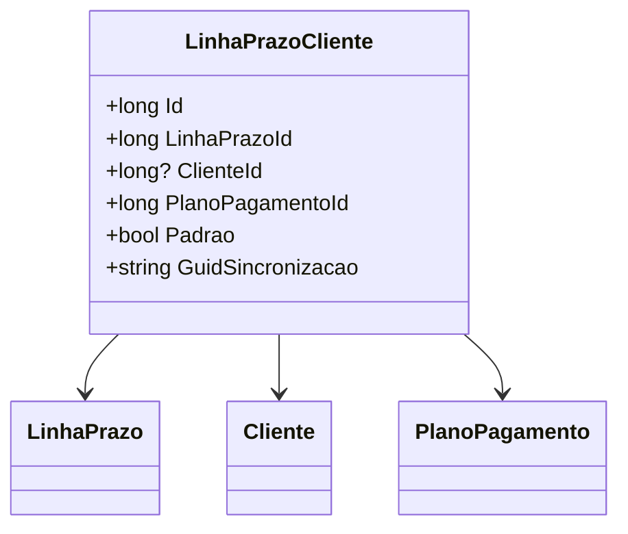

# LinhaPrazoCliente
**Namespace**: IsthmusWinthor.Dominio.Entidades  
**Nome do Arquivo**: LinhaPrazoCliente.cs  

## Visão Geral e Responsabilidade
A classe `LinhaPrazoCliente` atua como uma entidade que modela o relacionamento entre as linhas de prazo, clientes e planos de pagamento no contexto de uma aplicação de gestão de pagamentos. Seu papel principal é garantir que um cliente esteja associado a um prazo específico através de seu plano de pagamento, controlando a sincronização e a definição de um padrão para essas associações. Isso é crucial para assegurar que os dados do cliente e suas opções de pagamento estejam sempre em conformidade com as regras de negócio da aplicação.

## Métodos de Negócio
*A classe atualmente não possui métodos de negócio com lógica complexa implementada.* 

## Propriedades Calculadas e de Validação
A classe não contém propriedades com lógica condicional ou validação no getter/setter. Todas as propriedades são simples e não possuem regras de negócio atreladas à sua manipulação.

## Navigation Properties
- `LinhaPrazo`: [LinhaPrazo](LinhaPrazo.md)
- `Cliente`: [Cliente](Cliente.md)
- `PlanoPagamento`: [PlanoPagamento](PlanoPagamento.md)

## Tipos Auxiliares e Dependências
- Nenhum enumerador ou classe estática/helper é utilizado diretamente por esta classe.

## Diagrama de Relacionamentos

A documentação acima segue a estrutura requerida e fornece um resumo claro da classe `LinhaPrazoCliente`, seus relacionamentos e responsabilidades dentro do domínio da aplicação.
---
Gerada em 29/12/2025 20:38:50
