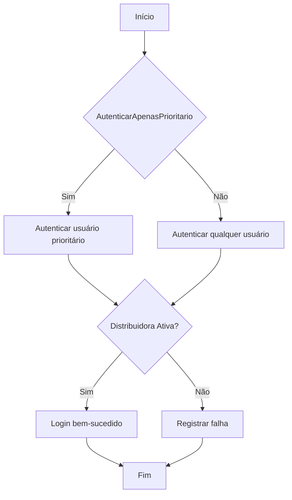
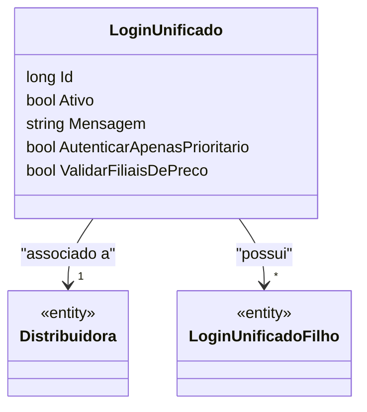

# LoginUnificado
**Namespace**: IsthmusWinthor.Dominio.Entidades  
**Nome do Arquivo**: LoginUnificado.cs  

## Visão Geral e Responsabilidade
A classe `LoginUnificado` representa um modelo de domínio que centraliza informações relacionadas ao processo de autenticação de usuários associados a uma distribuidora. Seu principal papel é gerenciar e facilitar o login de usuários prioritários, garantir a validação de preços em filiais, e manter a integridade dos dados dos logins associados. Este modelo é crucial para assegurar que apenas usuários autorizados acessem funcionalidades específicas do sistema, promovendo a segurança e a eficiência operacional.

## Métodos de Negócio
### Autenticar
- **Objetivo**: Garante que uma autenticação adequada seja realizada para usuários prioritários.
- **Comportamento**: 
  1. Verifica se a propriedade `AutenticarApenasPrioritario` está ativada.
  2. Se sim, autentica apenas usuários designados como prioritários, caso contrário, permite o login de qualquer usuário.
  3. Confirma se a distribuidora associada está ativa.
  4. Em caso de erro, registra uma mensagem apropriada na propriedade `Mensagem`.
- **Retorno**: Retorna `true` se a autenticação for bem-sucedida; `false` caso contrário.

## Propriedades Calculadas e de Validação
- **Mensagem**: Esta propriedade é usada para armazenar mensagens de erro durante o processo de autenticação. É definida somente quando ocorre uma falha no login e assegura que informações relevantes sejam fornecidas ao usuário.

## Navigation Properties
- [Distribuidora](Distribuidora.md): Representa a distribuidora associada ao login unificado.
- [LoginUnificadoFilho](LoginUnificadoFilho.md): Representa os logins filhos que são associados ao `LoginUnificado`. Esta coleção permite gerenciar múltiplos logins relacionados a uma única distribuidora.

## Tipos Auxiliares e Dependências
- **Enums e Classes**:
  - Não há enums ou classes auxiliares utilizadas diretamente nesta classe.

## Diagrama de Relacionamentos

