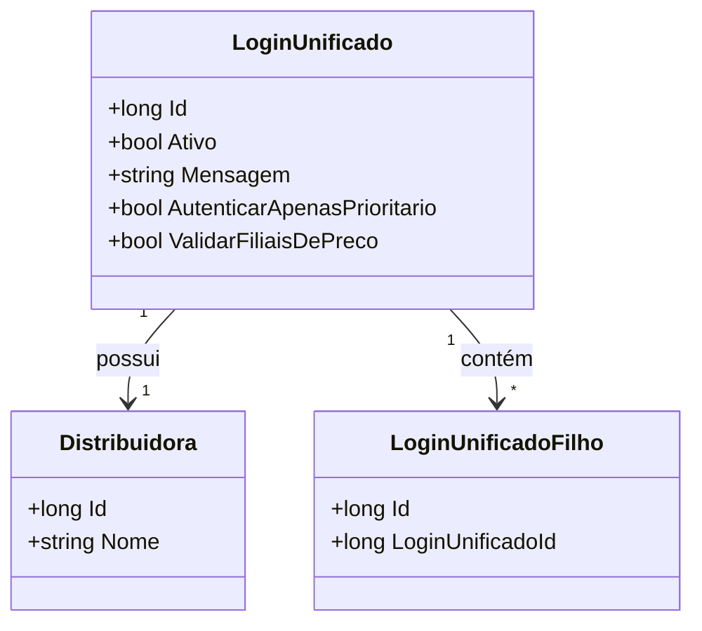

# LoginUnificado
**Namespace**: IsthmusWinthor.Dominio.Entidades  
**Nome do Arquivo**: LoginUnificado.cs  

## Visão Geral e Responsabilidade
A classe `LoginUnificado` representa a entidade responsável por gerenciar informações de login de forma unificada para diferentes distribuidoras dentro do sistema. Seu papel é facilitar a autenticação, considerando tanto a entidade principal `Distribuidora` como suas filiais, caso existam. Esta classe é essencial para garantir que os usuários sejam validados corretamente, permitindo flexibilidade na autenticação e no controle de acesso às informações da distribuidora.

## Métodos de Negócio
*(Nenhum método de negócio com lógica foi identificado nesta classe específica.)*

## Propriedades Calculadas e de Validação
- **Ativo**: Propriedade booleana que indica se o login unificado está ativo. É necessário que esta propriedade seja validada na aplicação, garantindo que apenas entidades ativas possam ser utilizadas para autenticação.
- **Mensagem**: Armazena mensagens relacionadas ao processo de autenticação ou estado da entidade, podendo ser utilizada para informar o usuário durante o login.
- **AutenticarApenasPrioritario**: Flag que determina se apenas os logins prioritários devem ser autenticados. Esta propriedade garante que o sistema permita uma autenticação diferenciada para usuários que possuem prioridade.
- **ValidarFiliaisDePreco**: Propriedade que indica se as filiais devem ser validadas em relação ao preço, assegurando que as variações de preço sejam adequadamente tratadas na hora da autenticação e autorização.

## Navigations Property
- [Distribuidora](Distribuidora.md): Representa a distribuidora associada ao login unificado.
- [LoginUnificadoFilho](LoginUnificadoFilho.md): Coleção de logins das filiais que estão associados ao login unificado.

## Tipos Auxiliares e Dependências
- `IEntidade`: Interface que define um contrato para entidades. 
- `LoginUnificadoFilho`: Classe utilizada para gerenciar informações de logins das filiais.

## Diagrama de Relacionamentos

---
Gerada em 29/12/2025 20:39:02
