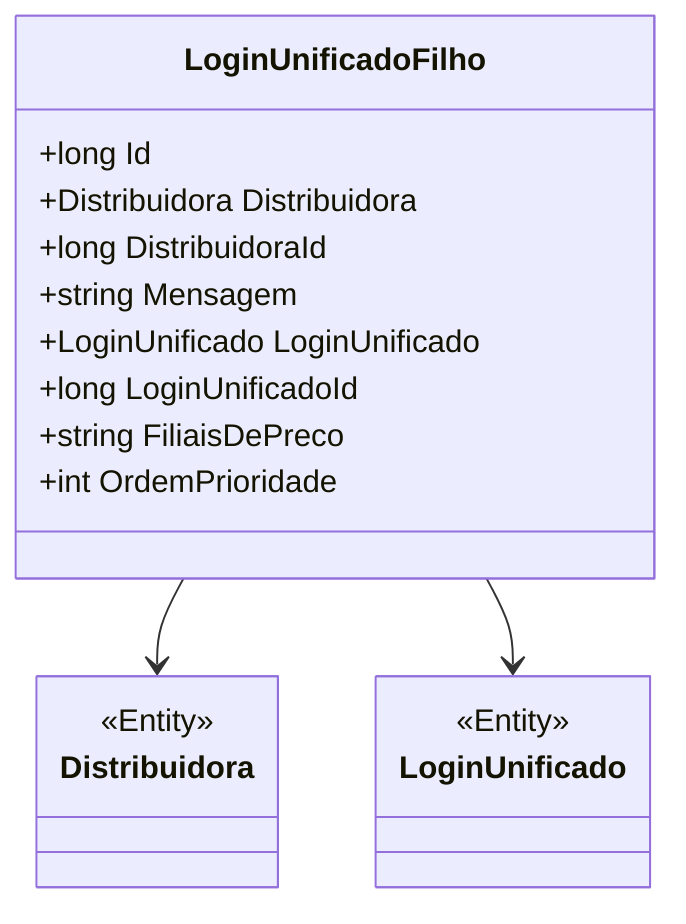

# LoginUnificadoFilho
**Namespace**: IsthmusWinthor.Dominio.Entidades  
**Nome do Arquivo**: LoginUnificadoFilho.cs  

## Visão Geral e Responsabilidade
A classe `LoginUnificadoFilho` representa um componente do sistema responsável por gerenciar informações relacionadas a uma filial de preço dentro de um contexto de login unificado. Essa entidade auxilia na organização e priorização de logins em distribuidoras, permitindo um controle mais eficaz sobre as filiais e suas respectivas mensagens associadas. Ela resolve o problema de gerenciamento de logins de forma unificada, facilitando a manutenção e a operação dos dados.

## Métodos de Negócio
A classe `LoginUnificadoFilho` não possui métodos com lógica de negócio complexa além de seus getters/setters que são simples. Portanto, não há métodos de negócio a serem detalhados neste documento.

## Propriedades Calculadas e de Validação
Nesta classe, todas as propriedades são representativas e não possuem lógica de cálculo complexa ou validação interna. Porém, é importante observar que a propriedade `OrdemPrioridade` deve ser atribuída de modo a garantir a correta priorização das filiais de login.

## Navigations Property
- `[Distribuidora](Distribuidora.md)`
- `[LoginUnificado](LoginUnificado.md)`

## Tipos Auxiliares e Dependências
Não há enumeradores ou classes estáticas/helpers diretamente utilizadas na classe `LoginUnificadoFilho`.

## Diagrama de Relacionamentos

