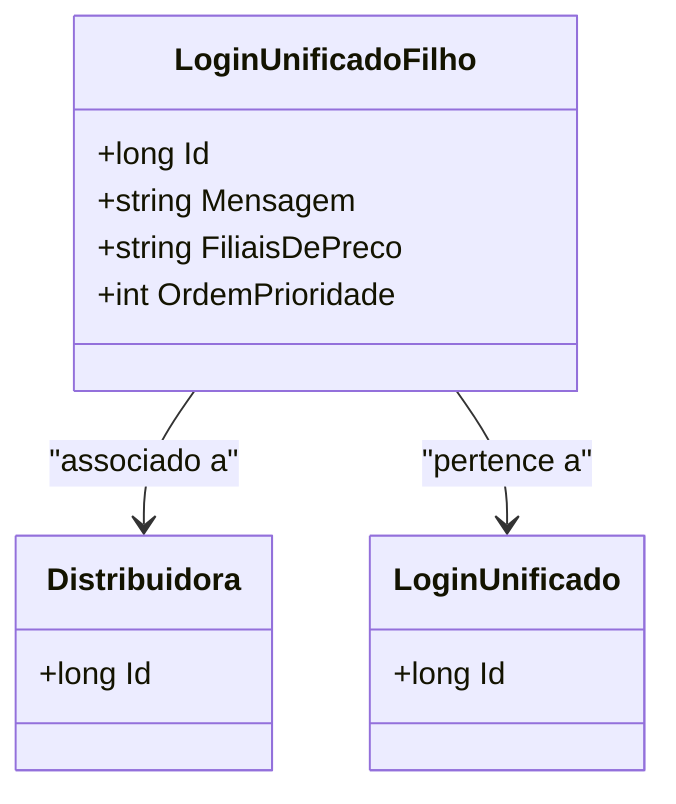

# LoginUnificadoFilho
- **Namespace**: IsthmusWinthor.Dominio.Entidades
- **Nome do Arquivo**: LoginUnificadoFilho.cs

## Visão Geral e Responsabilidade
A classe `LoginUnificadoFilho` representa uma entidade que vincula um login unificado a uma distribuidora específica dentro do sistema. O objetivo principal desta classe é gerenciar as associações entre diferentes distribuidoras e os logins unificados, garantindo a integridade e a organização das informações de acesso em um cenário onde múltiplas distribuidoras podem compartilhar um mesmo login. Este modelo é fundamental para evitar a duplicação de logins e para facilitar o gerenciamento dos acessos pelas filiais que atuam no sistema.

## Métodos de Negócio
Nenhum método com lógica foi identificado nesta classe. A implementação atual consiste apenas em propriedades para transporte de dados.

## Propriedades Calculadas e de Validação
Nenhuma propriedade com lógica de cálculo ou validação foi identificada nesta classe.

## Navigations Property
- [Distribuidora](Distribuidora.md)
- [LoginUnificado](LoginUnificado.md)

## Tipos Auxiliares e Dependências
Nenhum enumerador ou classe estática/helper foi identificado como dependência nesta classe.

## Diagrama de Relacionamentos

---
Gerada em 29/12/2025 20:39:11
