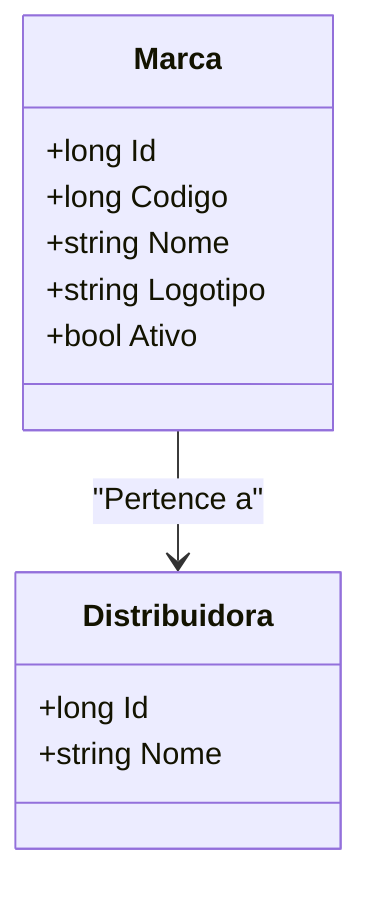

# Marca
**Namespace**: IsthmusWinthor.Dominio.Entidades  
**Nome do Arquivo**: Marca.cs  

## Visão Geral e Responsabilidade
A classe `Marca` representa uma entidade de domínio que encapsula as informações de uma marca em um sistema de gerenciamento de distribuidoras. Esta classe é responsável por assegurar que uma marca esteja devidamente associada a uma distribuidora, além de fornecer informações como código, nome e logotipo da marca. O problema de negócio que ela resolve é a necessidade de gerenciamento eficiente das marcas associadas a diferentes distribuidoras e garantir que as informações estão corretas e acessíveis.

## Métodos de Negócio
Esta classe não contém métodos com lógica de negócios além de suas propriedades de dados.

## Propriedades Calculadas e de Validação
- **Ativo**: Representa se a marca está ativa ou não. A lógica implementada permite apenas que marcas ativas possam ser associadas a vendas e tratamentos de dados, garantindo a integridade da operação comercial.

## Navigations Property
- **Distribuidora**: [Distribuidora](Distribuidora.md) - Representa a associação entre a marca e a distribuidora à qual ela pertence.

## Tipos Auxiliares e Dependências
- Não há enumeradores ou classes auxiliares diretamente utilizadas nesta classe.

## Diagrama de Relacionamentos

---
Gerada em 29/12/2025 20:39:17
