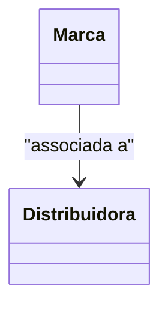

# Marca
**Namespace**: IsthmusWinthor.Dominio.Entidades  
**Nome do Arquivo**: Marca.cs

## Visão Geral e Responsabilidade
A classe `Marca` representa uma entidade de domínio que encapsula as informações e comportamentos associados a uma marca em um sistema de gerenciamento de produtos. Ela é responsável por armazenar dados relevantes como o nome da marca, seu código, logotipo e o estado de ativação. A `Marca` também cria uma associação com a entidade `Distribuidora`, o que permite a identificação de qual distribuidora está associada a cada marca. Essa estrutura ajuda a manter a integridade dos dados e facilita o gerenciamento de produtos relacionados a cada marca.

## Métodos de Negócio
*Nota: Não há métodos com lógica de negócios implementados visivelmente na classe, portanto, não há métodos a documentar neste momento.*

## Propriedades Calculadas e de Validação
- **Ativo**: Representa se a marca está ativa para uso no sistema. É esperado que esta propriedade seja utilizada em decisões de negócio como filtrar marcas que estão ativas para promoção ou exposição em catálogos de produtos.

## Navigations Property
- `[Distribuidora](Distribuidora.md)`: Representa a distribuidora associada à marca, sendo uma classe complexa que encapsula informações relacionadas ao fornecedor da marca.

## Tipos Auxiliares e Dependências
- Nenhum enumerador ou classe estática/helper foi identificado diretamente nesta classe.

## Diagrama de Relacionamentos

