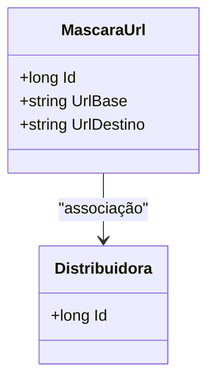

# MascaraUrl
**Namespace**: IsthmusWinthor.Dominio.Entidades  
**Nome do Arquivo**: MascaraUrl.cs  

## Visão Geral e Responsabilidade
A classe `MascaraUrl` é responsável por encapsular a lógica de conectividade entre uma distribuidora e suas URLs associadas. Este modelo de domínio representa uma entidade que permite a definição de uma URL base e uma URL destino, a qual pode ser utilizada em diversos cenários dentro do sistema onde o redirecionamento ou tradução de URLs é necessário. A sua existência garante que as informações sobre redirecionamento sejam devidamente associadas a uma distribuidora específica, implicando em um controle claro de URL por distribuidora e possibilitando operações direcionadas e rastreáveis.

## Métodos de Negócio
### (Nenhum método com lógica citada na implementação fornecida.)

## Propriedades Calculadas e de Validação
- **UrlBase**: Propriedade que pode ser validada para verificar se a URL segue um padrão correto ou se é uma URL válida antes de ser definida. Essa validação é importante para garantir que quaisquer operações que dependam dessa URL sejam corretamente direcionadas.

- **UrlDestino**: Assim como a UrlBase, essa propriedade pode ter uma validação para garantir que sua estrutura está correta e corresponde aos padrões de redirecionamento utilizados na aplicação.

## Navigations Property
- [Distribuidora](Distribuidora.md)

## Tipos Auxiliares e Dependências
- Nenhum enumerador ou classe estática foi identificado neste modelo de domínio.

## Diagrama de Relacionamentos

---
Gerada em 29/12/2025 20:39:25
