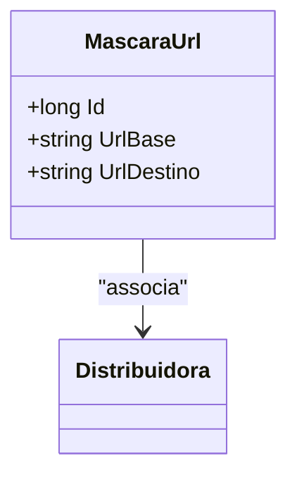

# MascaraUrl
**Namespace**: IsthmusWinthor.Dominio.Entidades  
**Nome do Arquivo**: MascaraUrl.cs  

## Visão Geral e Responsabilidade
A classe `MascaraUrl` representa a máscara de URL associada a uma distribuidora específica. Ela desempenha um papel crucial na gestão de URLs, permitindo que as aplicações façam redirecionamentos e formatações de URLs de forma consistente e controlada. Este modelo é fundamental para garantir que as URLs utilizadas nas interações com o sistema sejam apropriadas e que as distribuidoras tenham uma forma padronizada de gerenciar suas URLs associadas.

## Métodos de Negócio
Nenhum método com lógica foi incluído nesta classe, dado que ela é uma representação básica das entidades e suas propriedades.

## Propriedades Calculadas e de Validação
Nenhuma propriedade calculada ou de validação com lógica específica foi incluída nesta classe. Todas as propriedades são anêmicas.

## Navigation Property
- [Distribuidora](Distribuidora.md)

## Tipos Auxiliares e Dependências
Nenhum Enumerador (Enums) ou Classes Estáticas/Helpers foram identificadas como usadas pela classe `MascaraUrl`.

## Diagrama de Relacionamentos

Esta documentação fornece uma visão clara da estrutura e do comportamento da classe `MascaraUrl` no contexto do sistema corporativo.
