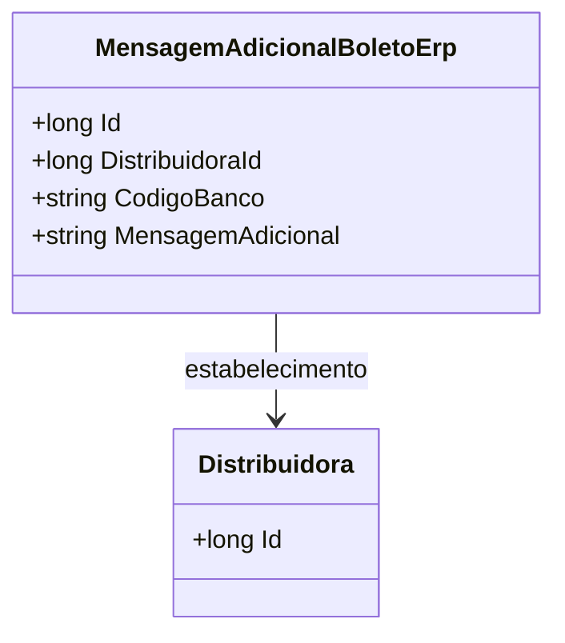

# MensagemAdicionalBoletoErp
- **Namespace**: IsthmusWinthor.Dominio.Entidades
- **Nome do Arquivo**: MensagemAdicionalBoletoErp.cs

## Visão Geral e Responsabilidade
A classe `MensagemAdicionalBoletoErp` representa uma entidade no contexto de um sistema de gestão de boletos. Sua principal responsabilidade é armazenar informações adicionais relacionadas a boletos gerados para uma distribuidora, como o código do banco e uma mensagem adicional que pode ser utilizada para fins de comunicação ou instruções específicas. A classe é essencial para garantir que todas as informações necessárias sejam agrupadas e acessíveis em um único lugar, facilitando a geração e a visualização de boletos.

## Propriedades
- `Id`: Identificador único da mensagem adicional do boleto. 
- `Distribuidora`: Referência a uma distribuidora que está associada a essa mensagem adicional.
- `DistribuidoraId`: Identificador da distribuidora no sistema.
- `CodigoBanco`: Código que identifica o banco associado a essa mensagem adicional.
- `MensagemAdicional`: Texto que contém informações extra a serem exibidas no boleto.

## Navigations Property
- [Distribuidora](Distribuidora.md): Representa a entidade que está relacionada à mensagem adicional do boleto.

## Tipos Auxiliares e Dependências
- `IEntidade`: Interface que esta classe implementa, evidenciando que ela é uma entidade do domínio.

## Diagrama de Relacionamentos

---
Gerada em 29/12/2025 20:39:33
