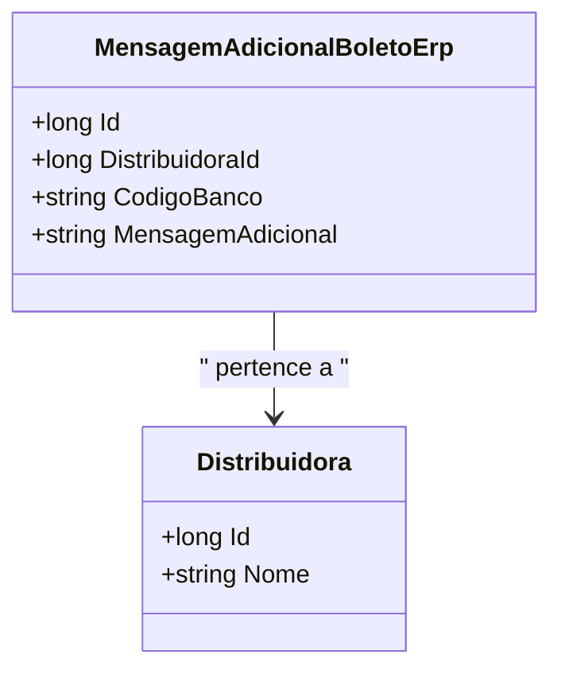

# MensagemAdicionalBoletoErp
**Namespace**: IsthmusWinthor.Dominio.Entidades  
**Nome do Arquivo**: MensagemAdicionalBoletoErp.cs

## Visão Geral e Responsabilidade
A classe `MensagemAdicionalBoletoErp` representa uma entidade de domínio que encapsula informações adicionais a serem incluídas em boletos gerados para um ERP. Ela tem como responsabilidade principal conectar a `Distribuidora` às mensagens adicionais que podem ser impressas no boleto, garantindo que informações relevantes estejam disponíveis para o processamento financeiro.

## Métodos de Negócio
Esta classe não possui métodos com lógica de negócio complexa, apenas propriedades de acesso direto.

## Propriedades Calculadas e de Validação
Esta classe não possui propriedades com lógica nos `getters` ou validações nos `setters`.

## Navigations Property
- `Distribuidora`: [Distribuidora](Distribuidora.md)

## Tipos Auxiliares e Dependências
- `IEntidade`: [IEntidade](IEntidade.md)

## Diagrama de Relacionamentos

