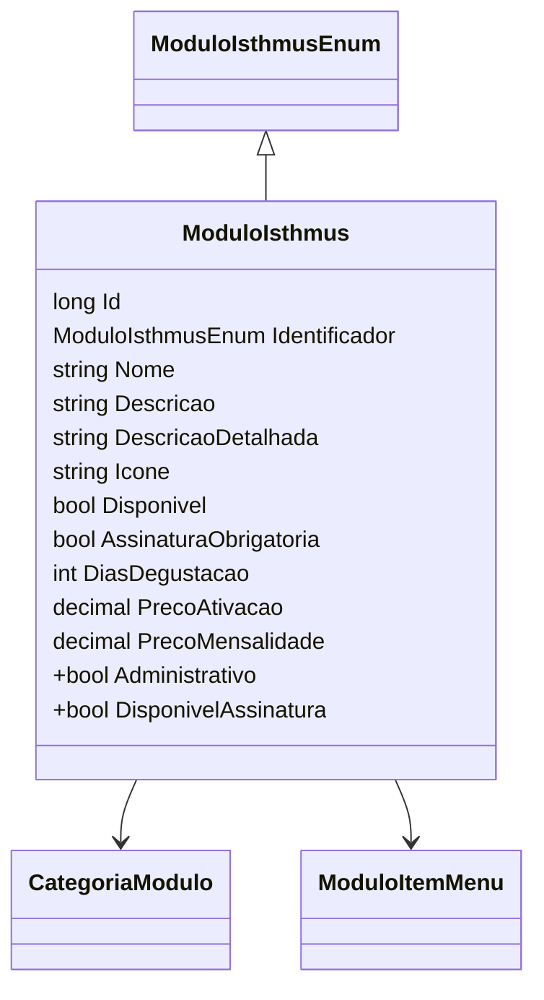

# ModuloIsthmus
**Namespace**: IsthmusWinthor.Dominio.Entidades  
**Nome do Arquivo**: ModuloIsthmus.cs  

## Visão Geral e Responsabilidade
A classe `ModuloIsthmus` representa um módulo dentro do sistema, encapsulando informações relevantes como identificadores, preços e disponibilidade. Ela é fundamental para a gestão dos módulos disponíveis para os usuários, permitindo operações de ativação e controle de assinaturas. O problema de negócio que resolve é a organização e gestão dos módulos que podem ser oferecidos, detalhando como cada módulo se comporta em termos de ativação e uso.

## Métodos de Negócio
- **Título**: `DisponivelAssinatura` (get, NotMapped)
  * **Objetivo**: Garante que um módulo só está disponível para assinatura se estiver marcado como disponível e não for do tipo Administrativo.
  * **Comportamento**: Verifica duas condições: 
    - Se o módulo está disponível (`Disponivel` == true).
    - Se o módulo não é do tipo Administrativo (`Identificador != ModuloIsthmusEnum.Administrativo`).
  * **Retorno**: Retorna um valor booleano que indica se o módulo pode ser assinado.

  ```mermaid
  flowchart TD
      A[Modulo Disponível?] -->|Sim| B{Tipo Administrativo?}
      B -->|Não| C[Disponível para Assinatura]
      B -->|Sim| D[Não Disponível para Assinatura]
      A -->|Não| D
  ```

- **Título**: `Administrativo` (get, NotMapped)
  * **Objetivo**: Determina se o módulo é do tipo Administrativo.
  * **Comportamento**: Verifica se o identificador do módulo é igual a `ModuloIsthmusEnum.Administrativo`.
  * **Retorno**: Retorna um valor booleano que indica se o módulo é administrativo.

  ```mermaid
  flowchart TD
      A[Identificador == Administrativo?] -->|Sim| B[É Módulo Administrativo]
      A -->|Não| C[Não é Módulo Administrativo]
  ```

## Propriedades Calculadas e de Validação
- **Administrativo**: Retorna true apenas se o `Identificador` for igual a `ModuloIsthmusEnum.Administrativo`. Esta propriedade é usada para garantir que a lógica que envolve módulos administrativos não interfira nas operações normais de assinatura.
  
- **DisponivelAssinatura**: Retorna true quando o módulo está disponível e não é do tipo Administrativo. Esta lógica assegura que os usuários só possam assinar módulos válidos.

## Navigations Property
- [`CategoriaModulo`](CategoriaModulo.md): Representa a categoria à qual o módulo pertence.
- [`ModuloItensMenu`](ModuloItemMenu.md): Uma coleção de itens de menu associados a este módulo.

## Tipos Auxiliares e Dependências
- [`ModuloIsthmusEnum`](ModuloIsthmusEnum.md): Enum utilizado para identificar os tipos de módulo.
- `IEntidade`: Interface implementada, que pode ser uma abstração para garantir a integridade das entidades do domínio.

## Diagrama de Relacionamentos

---
Gerada em 29/12/2025 20:39:49
