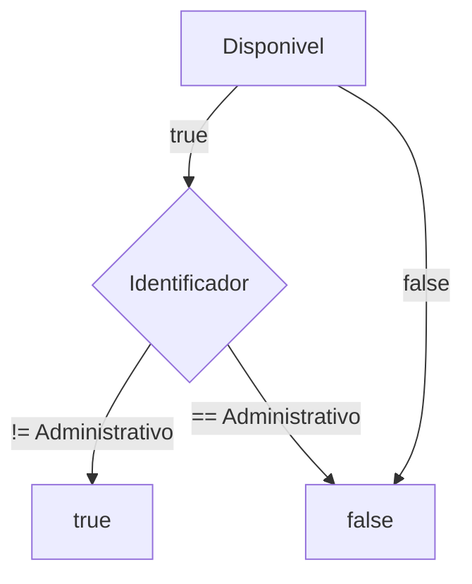
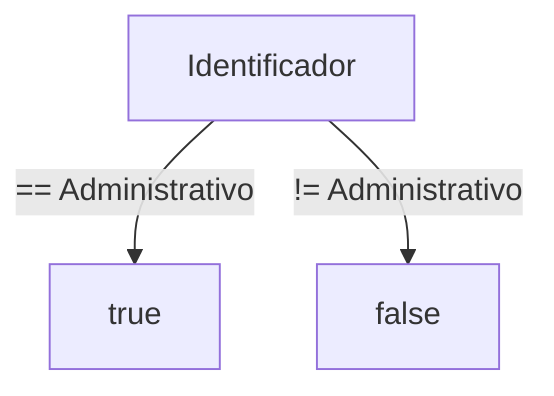
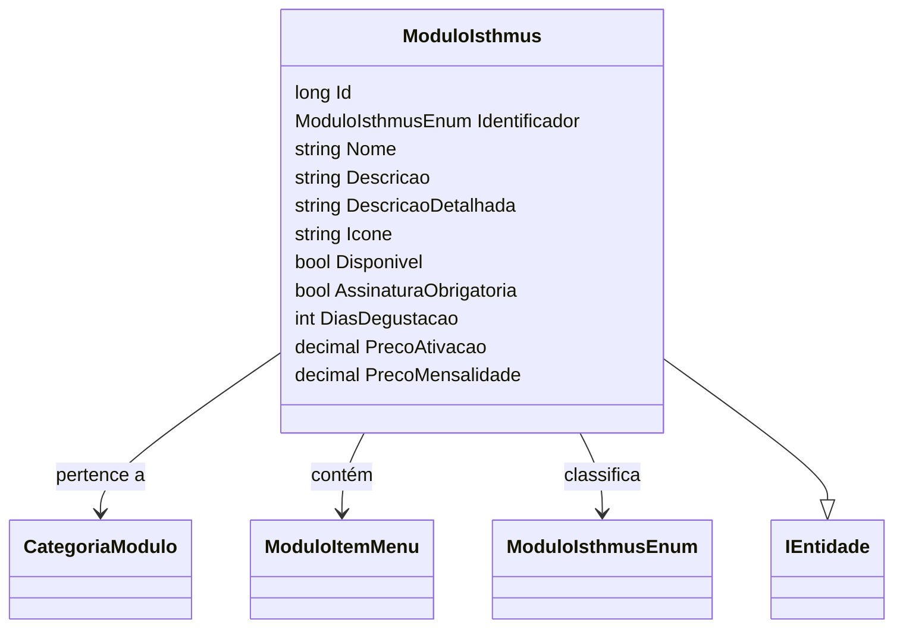

# ModuloIsthmus
**Namespace**: IsthmusWinthor.Dominio.Entidades  
**Nome do Arquivo**: ModuloIsthmus.cs  

## Visão Geral e Responsabilidade
A classe `ModuloIsthmus` representa um módulo no sistema Isthmus, encapsulando informações essenciais sobre a configuração e o gerenciamento dos módulos disponíveis para os usuários. Através desta classe, o sistema controla módulos que podem ser ativados, configurados e disponibilizados de acordo com regras de negócio definidas, como a necessidade de assinatura, preço de ativação e outros atributos.

## Métodos de Negócio

### Título: DisponivelAssinatura (Protegido)
**Objetivo**: Garante que um módulo esteja disponível para assinatura apenas se ele estiver ativo e não for do tipo administrativo.  
**Comportamento**: 
1. Verifica se a propriedade `Disponivel` do módulo é `true`.
2. Confere se o `Identificador` do módulo é diferente de `ModuloIsthmusEnum.Administrativo`.
3. Retorna `true` se ambas as condições forem satisfeitas; caso contrário, retorna `false`.

### Título: Administrativo (Protegido)
**Objetivo**: Indica se o módulo é do tipo administrativo ou não.  
**Comportamento**: 
1. Compara o `Identificador` do módulo com o valor `ModuloIsthmusEnum.Administrativo`.
2. Retorna `true` se o módulo for administrativo, caso contrário, retorna `false`.

## Propriedades Calculadas e de Validação

- **Administrativo**: Indica se o módulo é do tipo administrativo. A validação ocorre na leitura da propriedade, retornando `true` apenas se o `Identificador` for igual a `ModuloIsthmusEnum.Administrativo`.
- **DisponivelAssinatura**: Valida a disponibilidade de assinatura do módulo, retornando `true` se o módulo estiver disponível e não for do tipo administrativo.

## Navigation Property
- **CategoriaModulo**: `CategoriaModulo` representa a categoria à qual o módulo pertence. Link presumido: `[CategoriaModulo](CategoriaModulo.md)`.
- **ModuloItensMenu**: Coleção de `ModuloItemMenu` que representa os itens de menu associados ao módulo. Link presumido: `[ModuloItemMenu](ModuloItemMenu.md)`.

## Tipos Auxiliares e Dependências
- **ModuloIsthmusEnum**: Enum utilizado para categorizar os módulos em tipos. Link: `[ModuloIsthmusEnum](ModuloIsthmusEnum.md)`.
- **IEntidade**: Interfície que a classe implementa, representando uma entidade do domínio. Link presumido: `[IEntidade](IEntidade.md)`.

## Diagrama de Relacionamentos

