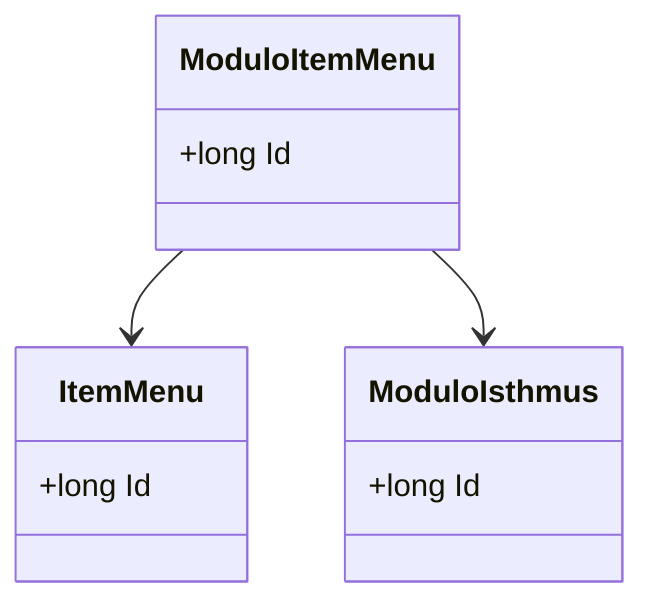

# ModuloItemMenu
**Namespace**: IsthmusWinthor.Dominio.Entidades  
**Nome do Arquivo**: ModuloItemMenu.cs  

## Visão Geral e Responsabilidade
A classe `ModuloItemMenu` representa uma relação entre um `ItemMenu` e um `ModuloIsthmus`. É responsável por vincular menus a módulos dentro do sistema, permitindo que os itens do menu sejam organizados e gerenciados conforme a estrutura lógica dos módulos. Esta relação é essencial para garantir a integridade da interface do usuário, assegurando que os itens do menu sejam exibidos de acordo com a autorização e configuração dos módulos.

## Métodos de Negócio
*(Neste caso, a classe não possui métodos com lógica de negócios além dos getters e setters simples.)*

## Propriedades Calculadas e de Validação
*(A classe não contém propriedades que possuem lógica de validação ou cálculos específicos.)*

## Navigations Property
- [ItemMenu](ItemMenu.md)
- [ModuloIsthmus](ModuloIsthmus.md)

## Tipos Auxiliares e Dependências
*(A classe não faz uso de enumeradores ou classes auxiliares específicas.)*

## Diagrama de Relacionamentos

---
Gerada em 29/12/2025 20:39:56
