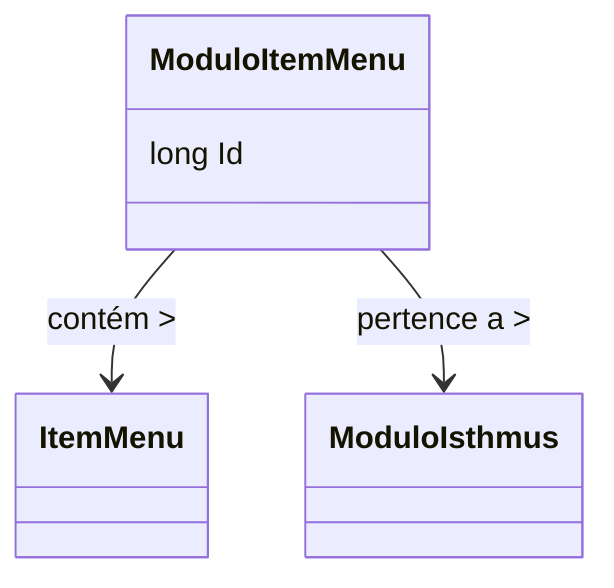

# ModuloItemMenu
- **Namespace**: IsthmusWinthor.Dominio.Entidades
- **Nome do Arquivo**: ModuloItemMenu.cs

## Visão Geral e Responsabilidade
A classe `ModuloItemMenu` representa uma associação entre um item de menu e um módulo dentro do sistema. O principal objetivo dessa classe é garantir a integridade e a relacionabilidade entre módulos e seus itens de menu, permitindo que o sistema gerencie adequadamente quais itens de menu pertencem a quais módulos, facilitando a navegação e o acesso a funcionalidades específicas.

## Navegação Property
- `[ItemMenu](ItemMenu.md)`: Representa a classe que define as propriedades e comportamentos de um item de menu.
- `[ModuloIsthmus](ModuloIsthmus.md)`: Representa a classe que contém as propriedades e comportamentos de um módulo dentro do sistema.

## Tipos Auxiliares e Dependências
- Nenhum tipo auxiliar ou enumerador específico foi identificado nesta classe.

## Diagrama de Relacionamentos

