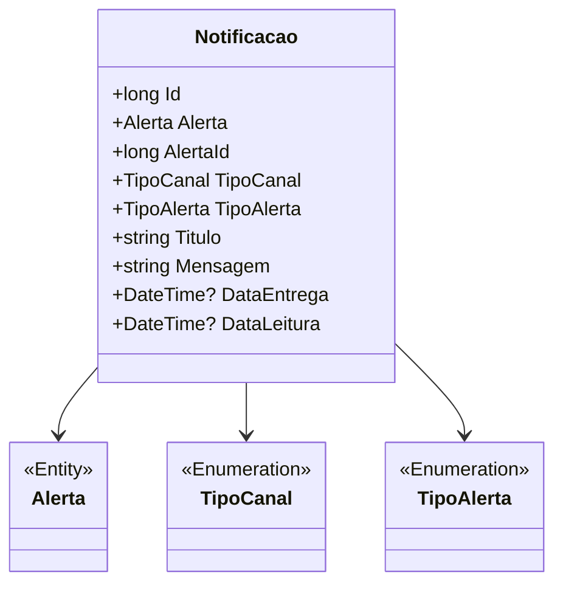

# Notificacao
- **Namespace**: IsthmusWinthor.Dominio.Entidades
- **Nome do Arquivo**: Notificacao.cs

## Visão Geral e Responsabilidade
A classe `Notificacao` representa uma notificação que é enviada a um usuário, encapsulando informações relacionadas a um alerta específico, como o título, a mensagem e as datas de entrega e leitura. Este modelo é utilizado para gerenciar a comunicação entre o sistema e o usuário, garantindo que as notificações sejam adequadamente rastreadas e processadas. O problema de negócio que esta classe resolve é a necessidade de um sistema estruturado para criar, armazenar e acompanhar notificações, o que é essencial para uma comunicação eficaz em sistemas corporativos.

## Métodos de Negócio
Esta classe não possui métodos de negócio que implementem lógica interna complexa. Portanto, não há métodos para documentar neste momento.

## Propriedades Calculadas e de Validação
Esta classe não apresenta propriedades com lógica em seu `get` ou validação em seu `set`. Assim, não há propriedades a serem listadas.

## Navigations Property
- [Alerta](Alerta.md): Representa a relação entre uma notificação e um alerta específico.

## Tipos Auxiliares e Dependências
- [TipoCanal](TipoCanal.md): Enum que representa os diferentes canais pelos quais a notificação pode ser enviada.
- [TipoAlerta](TipoAlerta.md): Enum que lista os tipos de alertas disponíveis para uso nas notificações.

## Diagrama de Relacionamentos

---
Gerada em 29/12/2025 20:40:06
