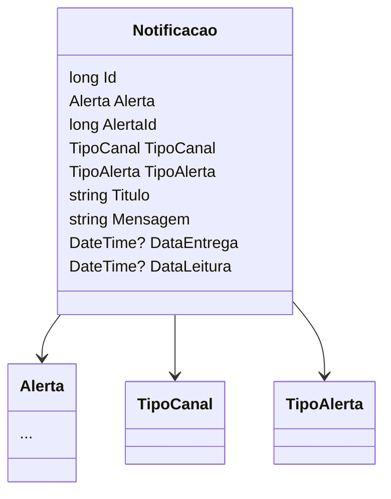

# Notificacao
- **Namespace**: IsthmusWinthor.Dominio.Entidades  
- **Nome do Arquivo**: Notificacao.cs  

## Visão Geral e Responsabilidade
A classe `Notificacao` representa uma entidade no domínio que gerencia as informações sobre notificações a serem enviadas aos usuários. Ela lida com os detalhes de entrega e leitura de mensagens, garantindo que as notificações sejam geridas de forma eficaz. O problema de negócio que esta classe resolve é a necessidade de um sistema de comunicação eficiente entre a aplicação e seus usuários, permitindo que os alertas sejam entregues e lidos conforme necessário.

## Métodos de Negócio
*Observação: A classe `Notificacao` não possui métodos de negócio complexos visíveis que conte com lógica além de getters/setters. Portanto, a seção "Métodos de Negócio" não se aplica.*

## Propriedades Calculadas e de Validação
- Não há propriedades que envolvam lógica no `get` ou validação no `set`.

## Navigations Property
- `[Alerta](Alerta.md)`: Representa a associação entre a notificação e um alerta.

## Tipos Auxiliares e Dependências
- `TipoCanal`: Enum que define os tipos de canal de comunicação da notificação.  
- `TipoAlerta`: Enum que define os tipos de alerta que a notificação pode enviar.  

## Diagrama de Relacionamentos

