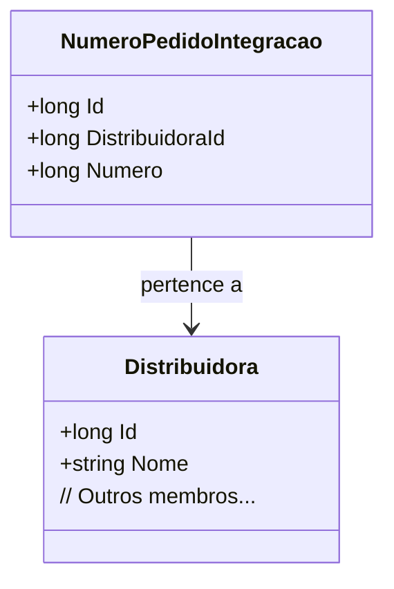

# NumeroPedidoIntegracao
- **Namespace**: IsthmusWinthor.Dominio.Entidades
- **Nome do Arquivo**: NumeroPedidoIntegracao.cs

## Visão Geral e Responsabilidade
A classe `NumeroPedidoIntegracao` representa um identificador único para um pedido a ser integrado, vinculando-o a uma distribuidora específica. Essa classe é crucial para garantir que os pedidos sejam rastreados e gerenciados corretamente no sistema, estabelecendo relações de forma adequada entre pedidos e distribuidoras.

## Métodos de Negócio
*Nota: A classe não possui métodos de negócio complexos implementados e se limita a propriedades simples, portanto, não há métodos a serem detalhados neste documento.*

## Propriedades Calculadas e de Validação
- Não há propriedades com lógica de validação no `get` ou lógica de cálculo no `set`.

## Navigations Property
- `Distribuidora`: [Distribuidora](Distribuidora.md)

## Tipos Auxiliares e Dependências
- `IEntidade`: [IEntidade](IEntidade.md)

## Diagrama de Relacionamentos

Este diagrama oferece uma visão clara da relação entre a classe `NumeroPedidoIntegracao` e a classe `Distribuidora`, destacando a associação de um pedido a uma distribuidora específica. Esse relacionamento é fundamental para o correto gerenciamento dos pedidos dentro do sistema.
