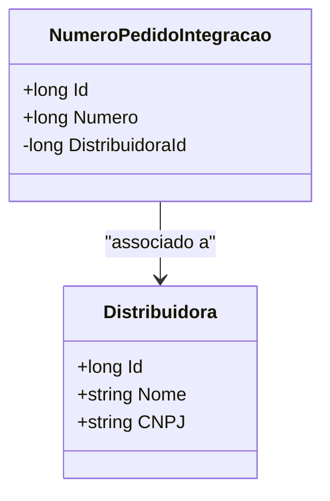

# NumeroPedidoIntegracao
**Namespace**: IsthmusWinthor.Dominio.Entidades  
**Nome do Arquivo**: NumeroPedidoIntegracao.cs  

## Visão Geral e Responsabilidade
A classe `NumeroPedidoIntegracao` representa um número de pedido associado a uma distribuidora em um sistema de integração. Seu papel é garantir que cada número de pedido esteja vinculado a uma distribuidora específica e fornecer um identificador único para esse ato de integração. O problema de negócio que esta classe ajuda a resolver é a manutenção da integridade e da rastreabilidade dos pedidos dentro de um contexto de operações com múltiplas distribuidoras.

## Propriedades Calculadas e de Validação
- `Id`: Identificador único do pedido, não possui lógica de validação além de ser um valor obrigatório e único.
- `Distribuidora`: Sem lógica de validação em sua propriedade, mas representa a associação obrigatória entre um pedido e uma distribuidora.
- `DistribuidoraId`: Chave estrangeira que vincula o pedido à distribuidora correspondente; deve ser preenchido sempre que um novo pedido for criado.
- `Numero`: Representa o número do pedido. Presume-se que tenha que seguir regras específicas de formato ou unicidade no contexto do negócio, mas não existe lógica implementada na classe para validação.

## Navigations Property
- [Distribuidora](Distribuidora.md): Representa a classe complexa que contém as informações sobre a distribuidora associada ao pedido.

## Tipos Auxiliares e Dependências
- Dependências adicionais não estão claramente expressas neste código, mas a interface `IEntidade` da qual `NumeroPedidoIntegracao` herda pode implicar outras funcionalidades relacionadas a entidades de domínio.

## Diagrama de Relacionamentos

---
Gerada em 29/12/2025 20:40:17
