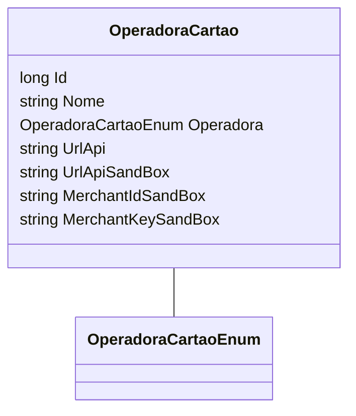

# OperadoraCartao
**Namespace**: IsthmusWinthor.Dominio.Entidades  
**Nome do Arquivo**: OperadoraCartao.cs  

## Visão Geral e Responsabilidade
A classe `OperadoraCartao` representa uma entidade de domínio que encapsula as informações relacionadas a operadoras de cartões de pagamento. Ela é responsável por armazenar dados essenciais para a interação com diferentes operadoras de cartões, incluindo a configuração de URLs para APIs e dados de autenticação, permitindo a comunicação e transações de pagamento de forma segura. O problema de negócio que ela resolve é a abstração e o gerenciamento eficaz das informações necessárias para processar pagamentos através de diversos provedores.

## Métodos de Negócio
A classe `OperadoraCartao` não contém métodos de negócio com lógica complexa, pois atualmente se apresenta como uma entidade pura que mantém dados.

## Propriedades Calculadas e de Validação
A classe não possui propriedades calculadas ou validações nos métodos `get` e `set`.

## Navigations Property
A classe `OperadoraCartao` não contém propriedades de navegação que sejam classes complexas do domínio.

## Tipos Auxiliares e Dependências
A classe usa o enumerador:
- `[OperadoraCartaoEnum](OperadoraCartaoEnum.md)`

## Diagrama de Relacionamentos

